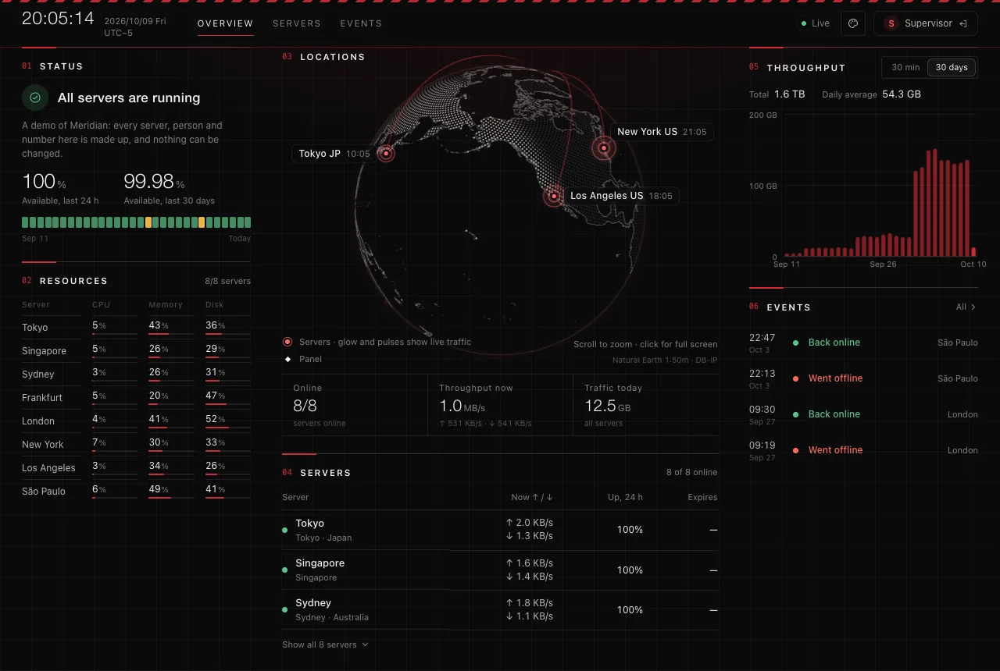
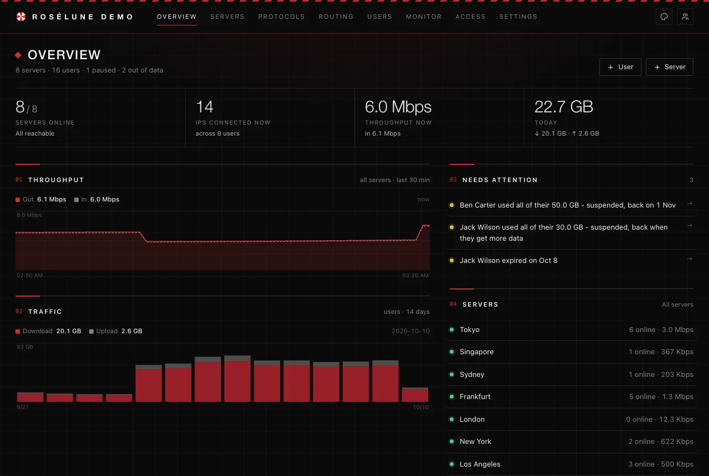
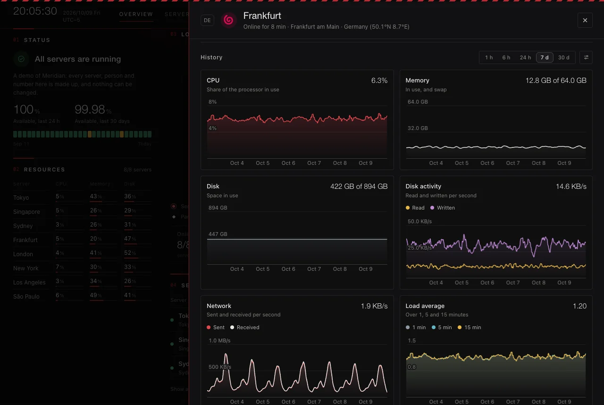
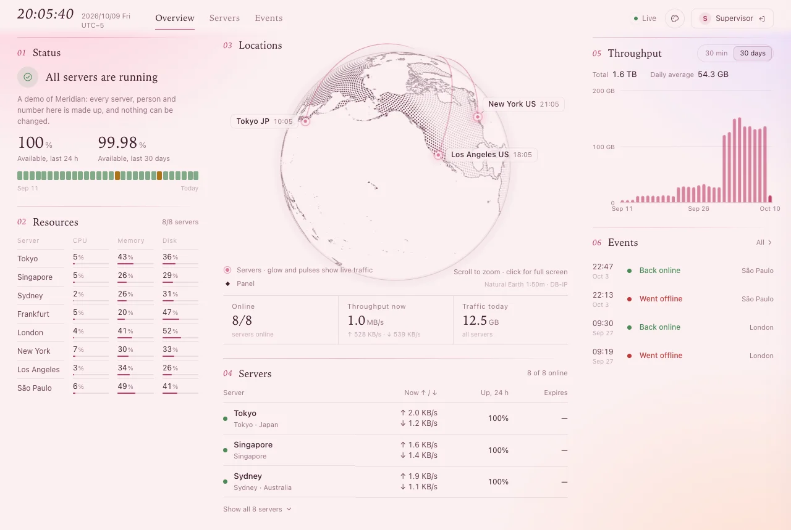

# Meridian

Meridian sets up VLESS, VMess, Trojan, Shadowsocks, Hysteria2 and WireGuard on your own Linux
servers, gives every user a link for their apps and a page of their own, and shows every server on a
live globe. It never pauses anyone or restarts a core on its own: limits raise alerts, and a restart
waits for a button that says what it will do.

**[Get started](../docs/getting-started.md)** · [Try the demo](https://deep.losantos.space) ·
[Releases](https://github.com/Dokoyamo-Lisa/Meridian/releases) ·
[Source on GitHub](https://github.com/Dokoyamo-Lisa/Meridian)

## Install

On a Linux server (amd64 or arm64, with systemd) with a domain name pointing to it:

```bash
curl -fsSLO https://raw.githubusercontent.com/Dokoyamo-Lisa/Meridian/main/skills/meridian-deploy/scripts/install-panel.sh
sudo bash install-panel.sh --domain panel.example.com
```

The installer checks the release, sets up HTTPS and PostgreSQL, and prints your first sign-in. The
panel then shows the one command that installs each server's agent.
[Getting started](../docs/getting-started.md) goes through every step.

## The demo

[deep.losantos.space](https://deep.losantos.space) is a Meridian panel to look around in: eight
servers and sixteen people that do not exist, a month of history, and agents reporting live. You are
let in without signing in, and nothing there can be changed.

## What it does

| | |
|---|---|
| **Runs the servers** | One command per server installs its agent. Forms accept only protocol combinations that work, and say which apps can use each one. Users, keys and settings change live; nobody is disconnected. |
| **Never disruptive on its own** | Data limits, end dates and device limits raise alerts; only a person pauses. A change that needs a core restart waits for your click. |
| **Users see their own** | Each user has a page with the data they have left, their devices, and their link with a QR code and one-tap import for every app. A Telegram bot answers them too. |
| **A status page** | Every server on a live globe, with its health, history and ping monitors, public or private. IP addresses stay hidden unless you show them; prices and users never appear. |
| **Traffic splitting** | Sites, countries, ports or BitTorrent go directly, through another server, a provider's proxy or a load balancer, for every server or a few, applied live. |
| **Health checks** | Every few minutes each agent looks for miners, new accounts and SSH keys, programs started from temporary folders, ports nobody opened and changed services, and asks you about them. |
| **Accountable** | Every connecting address with its user, server, place and network; destinations per user; traffic counted exactly once per user, protocol and day. |
| **Shared servers** | Lend a server to a friend's panel without your console. Reach servers whose address changes by their name, and IPv6-only servers wherever both ends can meet. |
| **Automatable** | A REST API with scoped tokens, and an MCP server, so an AI assistant can answer "who is sharing their link?" and asks first before anything disruptive. |
| **Yours to change** | Your name and logo, quiet tones or the Umbrella and Romance looks, your own CSS, and plugins that add pages, tools and filters. |

## See it



*The status page, in the Umbrella look.*



*The panel.*



*A server's history.*



*The same status page in Romance. Five quieter tones are a click away in the palette menu.*

## Protocols and apps

| Protocol | What it offers |
|---|---|
| VLESS | REALITY, TLS or none; raw, WebSocket, gRPC, HTTPUpgrade and XHTTP; Vision; post-quantum encryption |
| VMess, Trojan | Every transport, with TLS (and REALITY for Trojan), through a CDN where you like |
| Shadowsocks | 2022 ciphers and classic AEAD, over TCP and UDP; SOCKS5 and HTTP with a password per user |
| Hysteria2 | QUIC, with port hopping and obfuscation |
| WireGuard | In the kernel, with the official apps |

| Apps | How users add their link |
|---|---|
| Clash Verge, FlClash, mihomo | One tap from their page, or the link |
| sing-box, Hiddify | One tap from their page, or the link |
| Shadowrocket, Stash, Surge, Quantumult X, Loon | One tap, a QR code, or the link |
| v2rayN, v2rayNG, v2Box, NekoBox, Karing | The link, or a QR code |
| WireGuard | A QR code or a configuration file |

The link knows which app opens it, and a browser gets a page with QR codes and import buttons. Every
protocol says exactly which apps can use it. That list comes from the code that writes the
configurations, and tests check it with sing-box, mihomo and Xray themselves.

## Questions

### What does it cost?

Nothing. Meridian is free software under the AGPL-3.0: run it, read it, change it. If you offer a
changed version to others over a network, share your changes too.

### What do I need?

A Linux server for the panel (amd64 or arm64, with systemd) and a domain for it, plus Linux servers
for the proxies (with systemd or OpenRC). The panel can also run on one of them.

### Will installing it disturb what my servers already run?

No. The agent finds Xray, V2Ray, x-ui, 3x-ui, sing-box and Hysteria2 already there and imports
their protocols with the same keys and passwords, so devices keep working. It changes nothing it
does not manage.

### Who does it talk to?

GitHub (Meridian's releases and the cores'), DB-IP (the free database of where addresses are), Let's
Encrypt (certificates) and Cloudflare (to learn a server's public address). It talks to Telegram, a
webhook or your backup storage only if you set them up. Everything goes over HTTPS, and nothing about
your users leaves your servers.

### Can my users break something?

Users see their own page and nothing else. They cannot reach the panel, and their sessions are kept
apart from yours.

### Where do I ask?

In the repository's [issues](https://github.com/Dokoyamo-Lisa/Meridian/issues). Report a security
problem privately instead, through the repository's security advisory form (see
[SECURITY.md](../SECURITY.md)).
