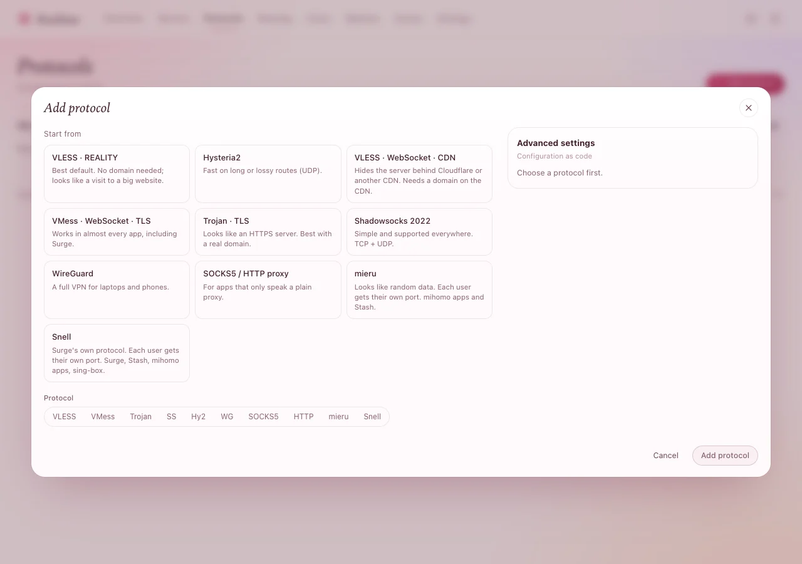
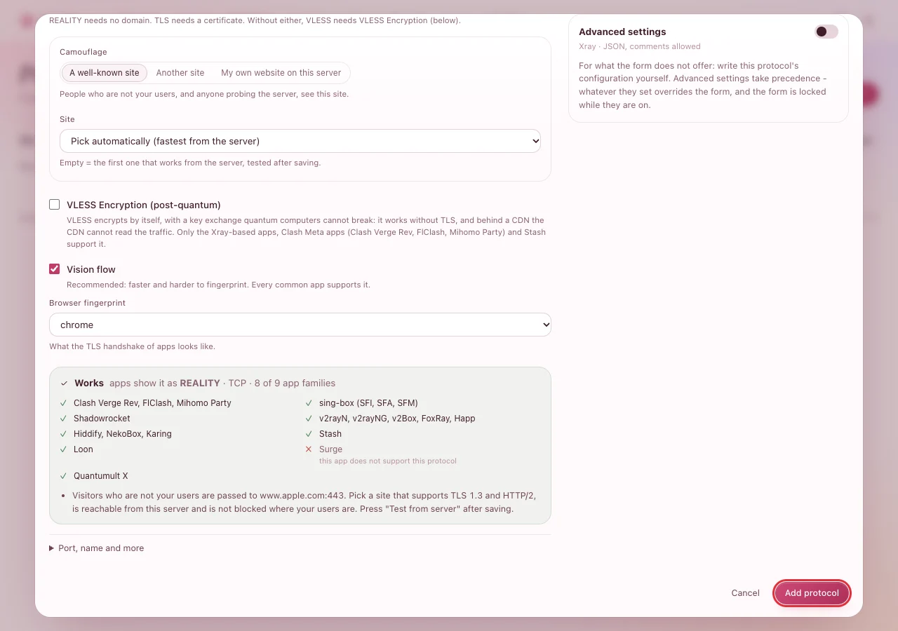
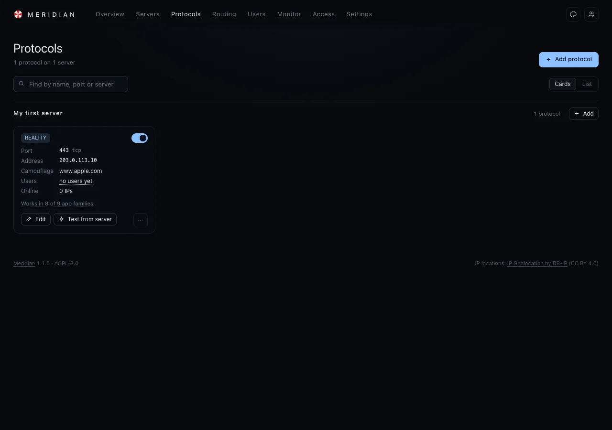

# Add a protocol

Two minutes. A protocol is what people's apps connect to on a server - think of it as the door. For
almost everyone, one door is enough: **VLESS · REALITY**. It needs no domain name, and to anyone
watching it looks like a visit to a big, well-known website.

You need: a server that shows **Online** (see [Add a server](add-a-server.md)).

## 1. Open the form

On the server's page, press **Add a protocol**. (Or: **Protocols** in the top menu, then **Add
protocol**, and pick the server.)

**You should see** the **Add protocol** window with a list called **Start from**.

## 2. Choose VLESS · REALITY

Click **VLESS · REALITY** - *Best default. No domain needed*. The form fills itself in; leave
everything as it is:

- **Camouflage**: *A well-known site*, **Site**: *Pick automatically (fastest from the server)*.
- **Vision flow**: ticked.

At the bottom, the green **Works** box lists the apps that can use this protocol. For REALITY that is
every common app except Surge.

## 3. Save it

Press **Add protocol**. The panel sends it to the server right away - nothing restarts, nobody is
disconnected.

**You should see** the **Protocols** page with a card for the new protocol: **REALITY**, port
**443 tcp**, the camouflage site, and *Works in 8 of 9 app families*.

## 4. Open the port at your provider

If your provider has a firewall in its own control panel ("security group"), allow incoming **TCP
443** to this server there - that is the port on the card. Without it, apps cannot connect even
though everything here looks fine.

> **Tip:** Press **Test from server** on the card. The server checks that the camouflage site works
> from where it is. If it does not, press **Edit** and pick another site from the list.

Next: [Add users](add-users.md).

## Other doors, for later

| | When to add it |
|---|---|
| **Hysteria2** | People far away from the server, or on unreliable connections: it is faster there. Uses UDP - open its port as **UDP** at your provider. |
| **WireGuard** | A full VPN for laptops and phones, with the official WireGuard apps. |
| **Shadowsocks 2022** | An app that cannot use the others. |
| **VLESS · WebSocket · CDN** | You want the server hidden behind Cloudflare. Needs a domain on Cloudflare. |

Each one shows its own **Works** box before you save - the panel refuses any combination that would
not work. [Setup in detail](../../docs/getting-started.md) explains every option.

## If something goes wrong

| What you see | What to do |
|---|---|
| The form refuses to save and says a port is in use | Another program on the server uses that port. Open **Port, name and more** and pick another port (then open that one at your provider). |
| **Test from server** fails | The camouflage site does not answer from this server. **Edit** the protocol and pick another site. |
| The card stays *starting up* for more than a minute | The server is downloading Xray for the first time. If it stays, open the server's page: its **Health** and the events say why. |
| Apps cannot connect later | See [Check that it works](check-it-works.md) - most often the provider's firewall (step 4). |
