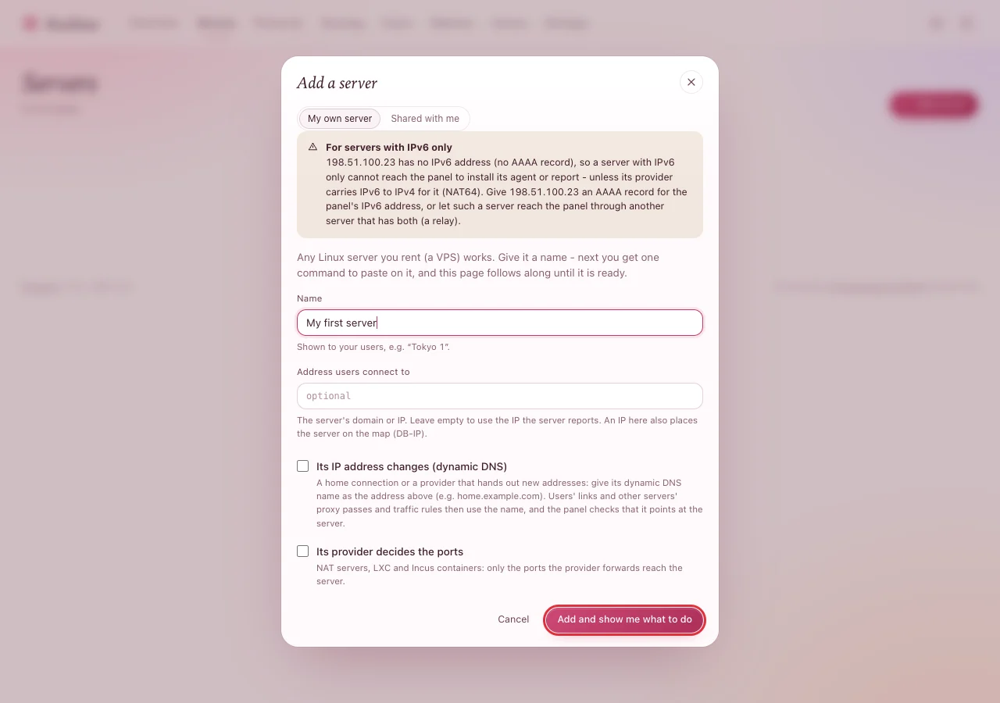
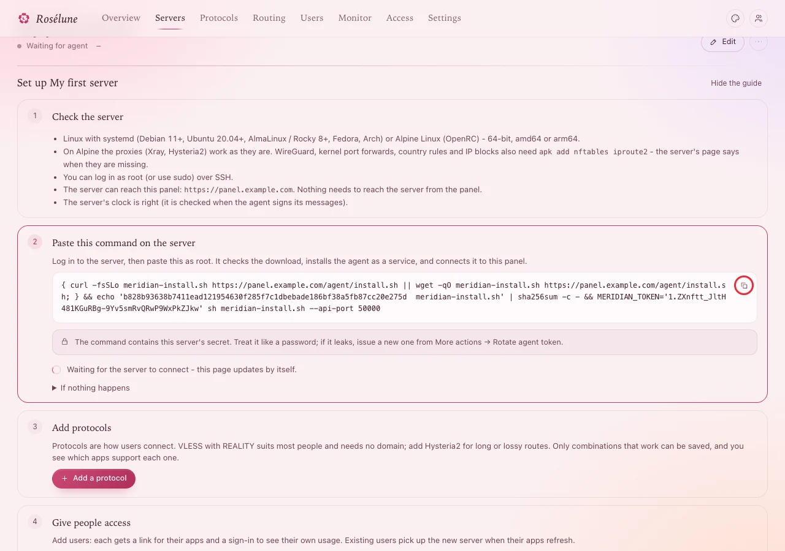
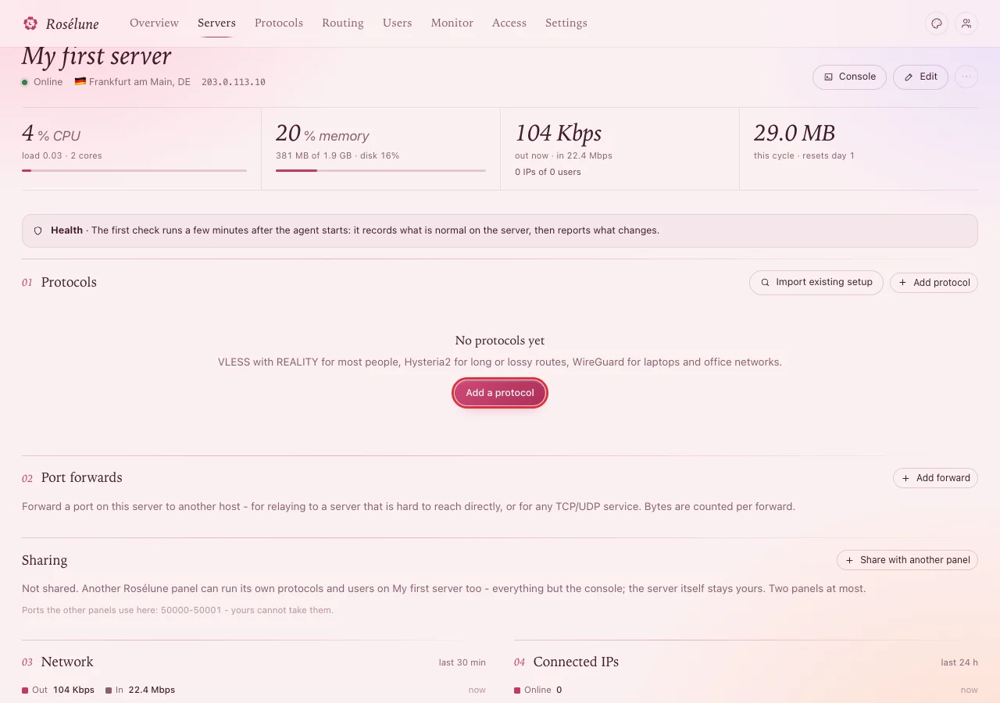

# Add a server

About five minutes per server. The panel gives you one command; you paste it on the server, and the
panel follows along until the server is connected.

> **Note:** A "server" is any Linux machine that will carry your users' traffic - a VPS you rent, in
> the country you want people to appear in. It can also be the server the panel runs on.

You need: the server's IP address and root access to it (the same checks as in
[Before you begin](before-you-begin.md) step 2: `whoami` says `root`).

## 1. Add it in the panel

1. Click **Servers** in the top menu, then **Add server**.
2. Type a **Name**. Your users see it in their apps, so a place works well: *Tokyo 1*, *Frankfurt*.
3. Leave **Address users connect to** empty: the panel uses the address the server reports. Leave
   both boxes below unticked.
4. Press **Add and show me what to do**.



**You should see** a page called **Set up My first server** with four steps, and *Waiting for agent*
at the top.

## 2. Copy the command

Step 2 on that page, **Paste this command on the server**, shows a long command. Press the **copy
button** at its right end.



> **Warning:** The command contains this server's secret. Treat it like a password: paste it only on
> this server. If it ever leaks, open the server's page, then **More actions › Rotate agent token**,
> and use the new command.

## 3. Paste it on the server

Log in to the server as root (`ssh root@203.0.113.10`), paste the command and press Enter.

**You should see**, within a few seconds:

```text
meridian-install.sh: OK
Downloading meridian-agent (amd64) from https://panel.example.com
Checking the connection to https://panel.example.com

Meridian agent installed and running.
The server shows up as online in the panel within a few seconds.
Logs: journalctl -u meridian-agent -f
```

## 4. Watch the panel

Go back to the panel - do not reload, the page updates by itself. Within a few seconds step 2 gets a
tick, and the server's page shows **Online**, where it is, its system, its processor, memory and disk.



Next: [Add a protocol](add-a-protocol.md) - the button is right there on the server's page.

## If something goes wrong

| What you see | What to do |
|---|---|
| `meridian-install.sh: FAILED` and `sha256sum: WARNING: 1 computed checksum did NOT match` | The command was copied only partly, or it is an old one. Copy it again with the copy button and paste it whole. |
| `curl: (6) Could not resolve host` | The server cannot find the panel's name. Check that `panel.example.com` has its DNS record (see [Before you begin](before-you-begin.md)). |
| `curl: (7) Failed to connect` | The server cannot reach the panel. Check the firewall of the panel's server (incoming 443 must be open) and of this server (outgoing traffic must be allowed). |
| `curl: command not found` | Install it (`apt-get install -y curl`, or `apk add curl` on Alpine), then paste the command again. |
| It says *installed and running*, but the panel keeps waiting | Look at the agent: `systemctl status meridian-agent --no-pager` and `journalctl -u meridian-agent -n 50 --no-pager`. |
| `clock skew` in the agent's log | The server's clock is wrong. Run `timedatectl set-ntp true`, wait a minute. |
| `panel refused this agent` in the agent's log | The command's secret was replaced. Copy the command from the setup page again and paste it. |
| The command shows `localhost` or a private address instead of your panel's name | Set the panel's public address in **Settings › Panel** first, then copy the command again. |

> **Good to know:** Pasting the command again is always safe. It repairs the agent and keeps the
> server's protocols and users.
