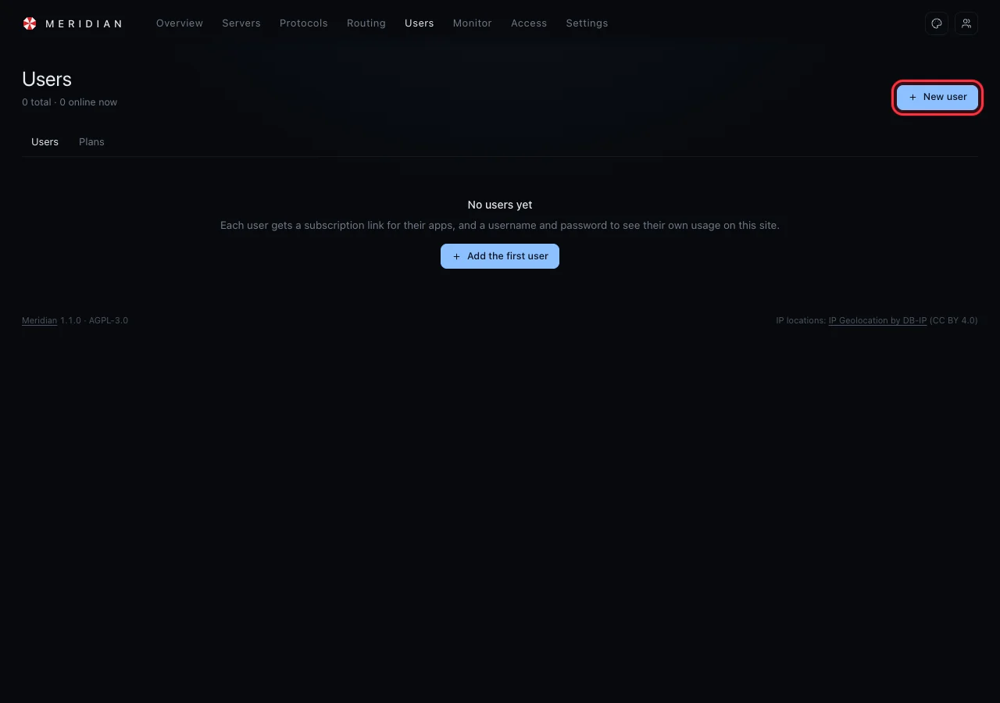
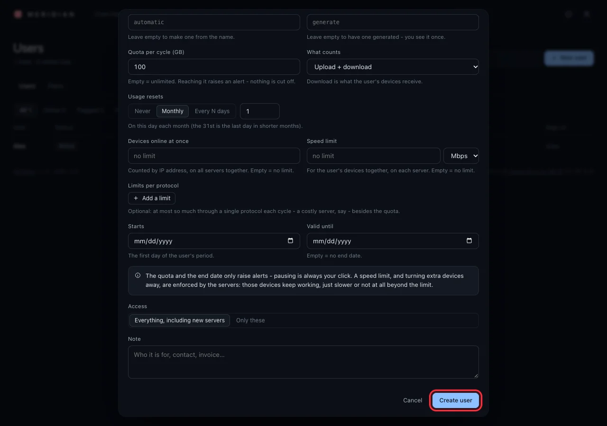
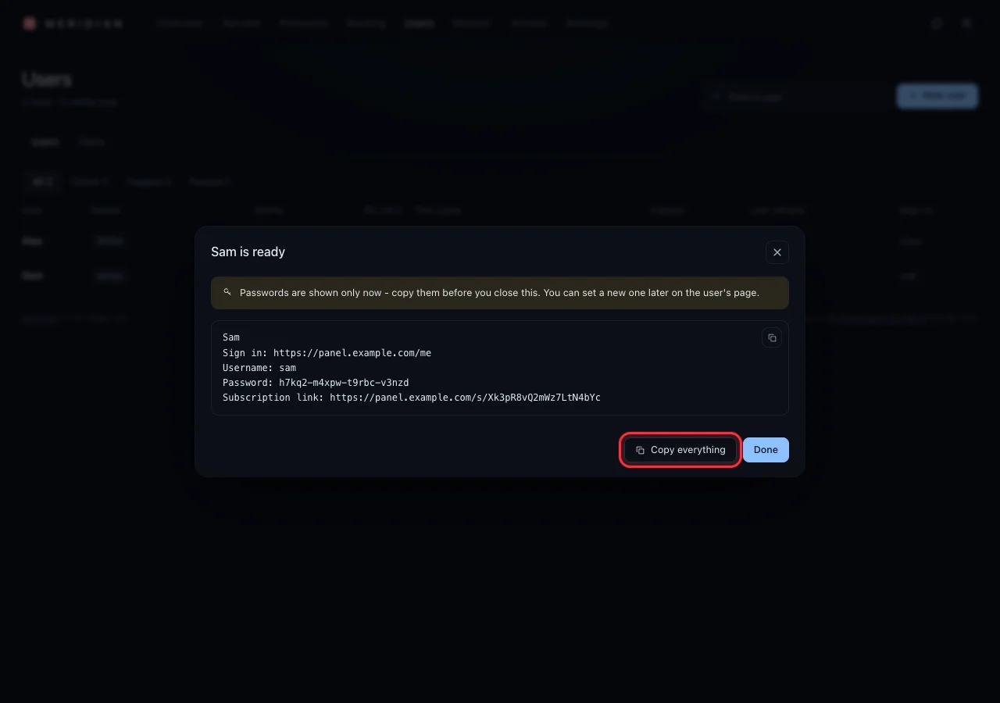
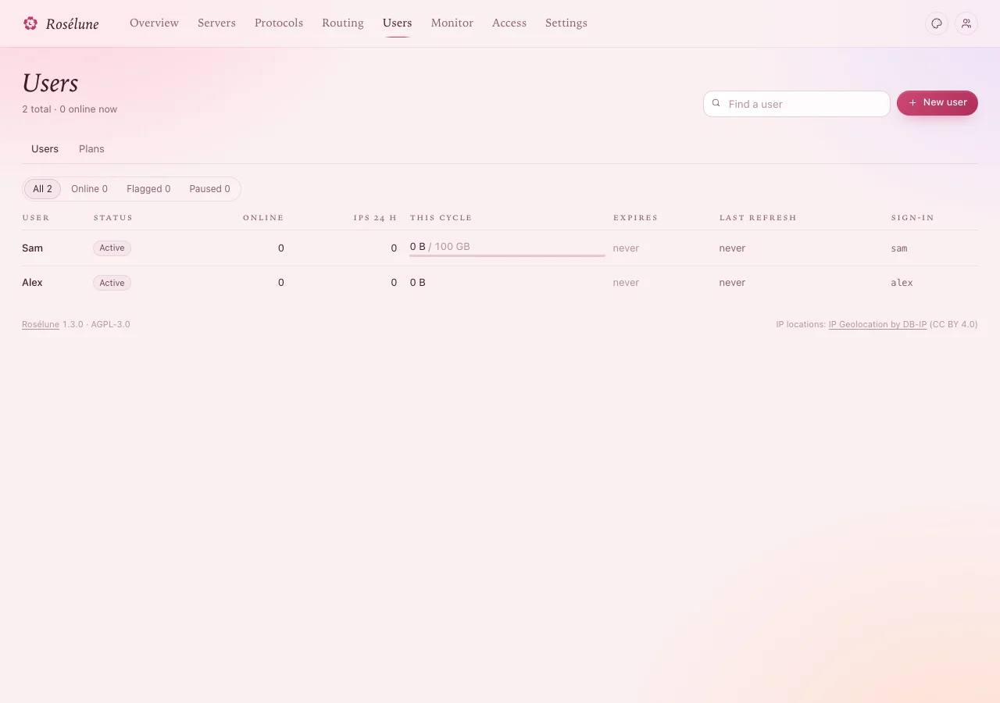

# Add users

Two minutes per person. A user is a person (or a team, or a device) you give access to. Each one
gets a **link** for their apps and a **sign-in** for their own page, where they see their data and
how to connect.

You need: a server with a protocol (see [Add a protocol](add-a-protocol.md)).

## 1. Open the form

Click **Users** in the top menu, then **New user**.

## 2. Fill it in

Only **Name** is needed - everything else can stay empty:

| Field | What to put |
|---|---|
| **Name** | Who it is: *Sam*, *Office laptop*. Only you see it. |
| **Username**, **Password** | Leave empty: the panel makes them (a username from the name, a strong password). |
| **Quota per cycle (GB)** | How much data a cycle - for example *100*. Empty = unlimited. |
| **Usage resets** | **Monthly** for a monthly allowance, **Never** for a one-off amount. |
| **Devices online at once** | For example *3*. Empty = no limit. |
| **Speed limit** | For example *300* **Mbps** (or *1* **Gbps**): the most this person's devices get together on each server. Empty = no limit. |
| **Valid until** | An end date, if the access should end. Empty = no end. |
| **Access** | *Everything, including new servers* - or **Only these** to pick servers. |

> **Good to know:** When someone uses up their **quota**, the servers stop serving them by
> themselves - until their data starts over on the reset day, or until you give them more. Then they
> are back without anyone's click (see [Everyday tasks](everyday.md#when-someone-uses-up-their-data)).
> An end date or a device limit only **tells you** when it is reached - in the panel and, if you set
> it up, on [Telegram](telegram-alerts.md); pausing someone is always your click.

Press **Create user**.

## 3. Copy what the person needs

**You should see** *Sam is ready*, with the sign-in address, username, password and link:

> **Warning:** The password is shown **only now**. Press **Copy everything** before you press
> **Done**, and send it to the person privately (a message only they can read).

Send them, together with what you copied, this guide's page for them:
[Connect a phone or computer](connect-devices.md). It walks them through the rest.

## 4. See them in the list

**You should see** the person in the **Users** list as *Active*, with their usage this cycle.

Next: [Connect a phone or computer](connect-devices.md), then
[Check that it works](check-it-works.md).

## If something goes wrong

| What you see | What to do |
|---|---|
| You closed the window before copying the password | Open the user, then **New password** under *Their own page*. A new one is made and shown once. |
| The link reached someone it should not | Open the user, then **⋯ › Issue a new link…**. The old link stops working; the person imports the new one. |
| The username is taken | Type another one in **Username**, or leave it empty. |
| You want the same limits for many people | Make a plan once (**Users › Plans**) and pick it in the form. |
