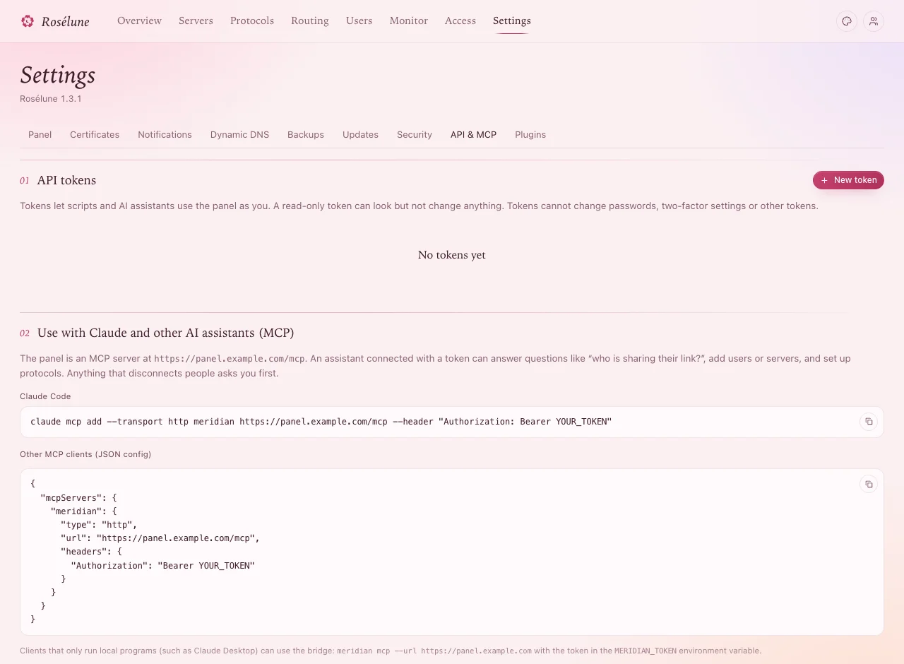

# Scripts, AI assistants and plugins

Everything you do in the panel can also be done by a script (the REST API) or an AI assistant (MCP),
with a token you make. Plugins go further: they change how the panel and the status page look and
work.

## An API token

1. **Settings › API & MCP** › **New token**.
2. A **Name** - where it is used, such as *Claude on my laptop*.
3. **Access**:
   - **Read only** - sees servers, users, IPs, destinations and events; changes nothing.
   - **Full access** - everything you can do in the panel, except passwords, two-factor and tokens.
4. **Expires**: **30 days**, **90 days**, **1 year** or **Never**.
5. **Create token**, then **Copy token** - it is shown **once**.

**You should see** the token in the list, with its access and when it was last used. **Revoke** stops
it at once.

> **Careful:** A full-access token is as good as your password for everything but signing in. Keep it
> where only the script or assistant can read it, give it an expiry, and prefer **Read only** where
> that is enough.



## Ask an AI assistant

The panel is an MCP server: an assistant with a token can answer questions like *who is sharing their
link?*, add users or servers, and set up protocols. Anything that disconnects people asks you first.

**Settings › API & MCP** › **Use with Claude and other AI assistants (MCP)** shows the exact lines,
with your panel's address. For Claude Code:

```bash
claude mcp add --transport http meridian https://panel.example.com/mcp --header "Authorization: Bearer YOUR_TOKEN"
```

Other MCP clients take the JSON shown there; clients that only run local programs (such as Claude
Desktop) use the bridge `meridian mcp --url https://panel.example.com` with the token in
`MERIDIAN_TOKEN`.

> **Good to know:** An assistant can never take protective steps on a server, open the console, or
> change passwords and tokens. It can tell you which button to press.

## The REST API

**Settings › API & MCP** › **REST API**: the reference of every endpoint, and **OpenAPI** to download
it. Every request carries the token:

```bash
curl -H "Authorization: Bearer YOUR_TOKEN" https://panel.example.com/api/users
```

More: [API](../../docs/api.md) and [AI assistants](../../docs/mcp.md) in the reference.

## Plugins

A plugin is a zip file: styles and scripts for the pages, and optionally a program beside the panel
that filters what servers run and what people's apps receive, or adds its own pages, API, assistant
tools and timers.

1. **Settings › Plugins** › **Upload a plugin**, and pick the zip. It stays off.
2. **Turn on** opens what it may do. Read it, tick **I trust where this plugin comes from and agree to
   all of the above**, and press **Turn on**.

**You should see** it in the list, on. **Upload new version** updates it; **Turn off** and **Remove**
are next to it.

> **Careful:** Install plugins only from people you trust: a plugin with a program runs on the
> panel's server. Writing your own: [Plugins](../../docs/plugins.md) in the reference.

## If something goes wrong

| What you see | What to do |
|---|---|
| *invalid or expired API token* | The token was revoked, expired, or copied in part. Make a new one. |
| *this API token is read-only* | It cannot change anything: use a full-access token for that. |
| The assistant cannot connect | Check the address ends in */mcp* and the token is sent as *Authorization: Bearer ...*. |
| A plugin keeps the panel from working | On the panel's host: `sudo -u meridian meridian plugins disable ID --data /var/lib/meridian` (`plugins list` shows the ID). |
