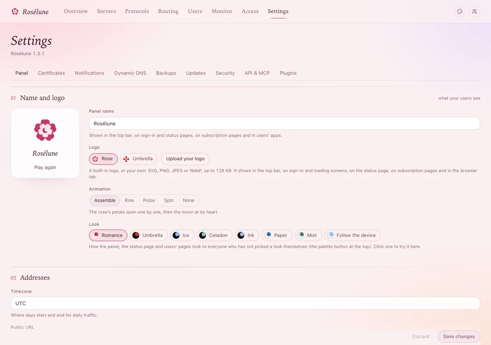

# Your name, logo and looks

The panel, the status page, people's own pages and the names in their apps can all carry your
service's name and logo. Everything is in **Settings › Panel** › **Name and logo**.

## 1. Name

**Panel name** - shown in the top bar, on the sign-in and status pages, on subscription pages and in
people's apps. Press **Save changes** at the bottom.

## 2. Logo

Under **Logo**, choose a built-in one - **Rose** (Rosélune's own) or **Umbrella** - or **Upload your
logo**: SVG, PNG, JPEG or WebP, up to 128 KB. It shows in the top bar, on sign-in and loading screens,
on the status page, on subscription pages and in the browser tab.

**Animation** - how the logo appears: **Assemble**, **Rise**, **Pulse**, **Spin** or **None**. **Play
again**, under the logo, shows it once more.

**You should see** the new logo at once in the preview; everyone sees it after **Save changes**. To go
back to a built-in one, press **Use the** *Rose* (or *Umbrella*).

## 3. The look

**Look** sets the colours everyone starts with: **Romance** (Rosélune's own, the default),
**Umbrella**, **Ice**, **Celadon**, **Ink**, **Paper**, **Mist** - or **Follow the device** (Ice in
the dark, Paper in the light). Click one to try it.

Each person can still pick their own look with the palette button at the top of the page; yours is
what they see until they do.

## 4. Your own styles (optional)

For more than colours: **Your own styles (CSS)**, below on the same page.

1. Choose **The panel** or **Status page and users' pages** (everyone who opens them sees it).
2. Write your CSS. The colours are variables, for example `:root { --accent: #e0673a; }`.
3. **Save styles**.

> **Good to know:** Style sheets cannot load images or fonts from other sites - use `data:`
> addresses for those. A whole theme can come as a plugin (**Settings › Plugins**).

## If something goes wrong

| What you see | What to do |
|---|---|
| The upload is refused | Make it smaller than 128 KB, in SVG, PNG, JPEG or WebP. |
| Your styles broke the page | Empty the box and **Save styles** - Rosélune's own styles come back. |
| People's apps still show the old name | Apps take the name with their next refresh of the link - within a few hours, or press update in the app. |
