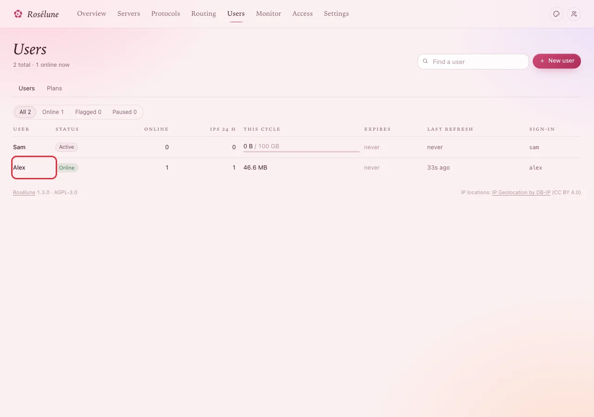
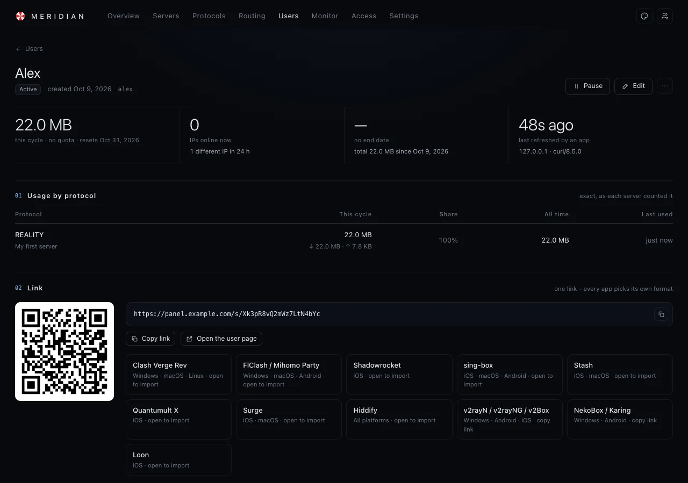

# Check that it works

Two minutes, right after someone connected for the first time - or any time someone says "it does
not work".

## 1. See them online

Open **Users**. The person's row says **Online**, with the number of devices online and the data
used this cycle going up.

Click their name for more: **Usage by protocol** shows which server and protocol carry their
traffic, counted exactly as the server measured it.

**You should see** the numbers grow while they use it. That is all: it works.

## 2. They are not online? Go through this list

Work from the top; most problems are found in the first three rows.

| Check | Where | What you want to see |
|---|---|---|
| The server is up | **Servers** | A green dot and **Online**. |
| The protocol runs | **Protocols** | The card does not say *starting up* or show an error. |
| The port is open at the provider | Your provider's control panel (firewall, security group) | Incoming traffic allowed to the protocol's port - **TCP** for VLESS, Trojan, VMess, Shadowsocks; **UDP** for Hysteria2 and WireGuard. |
| The user is not paused or out of data | The user's page | **Active** or **Online**, not *Paused* or *Out of data* (see [When someone uses up their data](everyday.md#when-someone-uses-up-their-data)). |
| The app has the newest link | The person's app | Update the profile in the app (or add it again from their page). |
| The camouflage site works | **Protocols** › the card › **Test from server** | It says the site answered. |
| The device's clock is right | The person's phone or computer | Automatic date and time on. |

> **Tip:** A quick test from your own phone: make yourself a user, connect with Hiddify (see
> [Connect a phone or computer](connect-devices.md)), and watch your own row in **Users**.

## 3. Still stuck?

The server's page shows its **Health** and its latest events, and **Monitor** shows every connection
and event of every server. See [When something goes wrong](troubleshooting.md) for messages and
what they mean, and how to ask for help.
