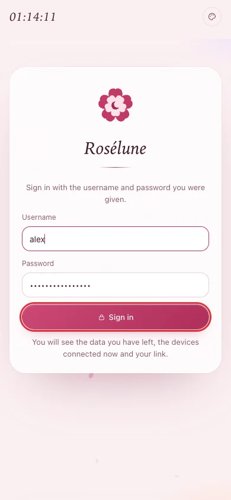
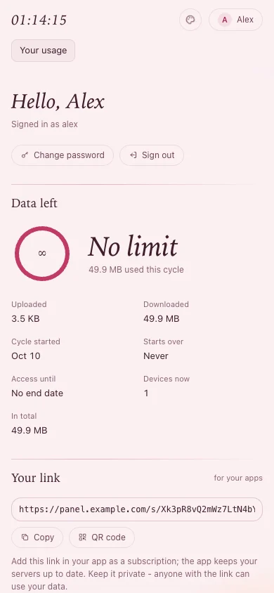
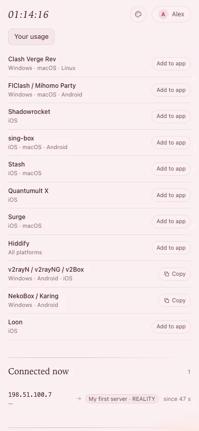

# Connect a phone or computer

**This page is for the people who were given access.** If you run the service, send it to them
together with their sign-in details.

About five minutes per device. You install an app, open your own page, tap one button, and connect.

You need: the details you were sent - the address of your page (it ends in `/me`, for example
`https://panel.example.com/me`), a **username** and a **password**.

## 1. Install an app

If you are not sure, take **Hiddify**: it is free and works on every device.

| Your device | App | Where to get it |
|---|---|---|
| iPhone, iPad | **Hiddify** | App Store - search for *Hiddify* |
| Android | **Hiddify** | Google Play - search for *Hiddify* |
| Mac | **Hiddify** | App Store - search for *Hiddify* |
| Windows | **Hiddify** | The [Hiddify releases page](https://github.com/hiddify/hiddify-app/releases): the Windows setup file of the newest release |
| Linux | **Hiddify** | The [Hiddify releases page](https://github.com/hiddify/hiddify-app/releases): the Linux file of the newest release |

> **Tip:** Other apps work too - Shadowrocket, Clash Verge Rev, sing-box, Stash and more. Your page
> lists every app that works with your access.

## 2. Open your page on that device

On the phone or computer you want to connect, open the address you were sent in the browser. Type
your username and password, then tap **Sign in**.

**You should see** your page: the data you have left, **Your link**, and further down **Add to your
app**.

## 3. Add your link to the app

Under **Add to your app**, find your app and tap **Add to app**. Your device asks whether to open the
app: allow it. The app adds your service as a new profile (some apps ask you to confirm with **Add**
or **OK**).

- **The app shows "Copy" instead** (v2rayN, v2rayNG, v2Box, NekoBox, Karing): tap **Copy**, open the
  app, and add a profile **from the clipboard** - usually the **+** button.
- **Setting up a computer with your phone's help** (or the other way round): tap **QR code** on one
  device and scan it with the app on the other.

## 4. Connect

In the app, tap the big **connect** button. The first time, your device asks to allow a VPN
configuration: allow it (an iPhone asks for Face ID or your passcode).

**You should see** the app say *Connected*, and websites open as usual. Reload your page in the
browser: **Connected now** shows your device.

## Good to know

- **Keep your link private.** Anyone who has it can use your data.
- **Nothing to update by hand.** The app refreshes your link by itself, so new servers appear on
  their own.
- **Your page is always there** for how much data you have left, when it resets, and your devices.

## If something goes wrong

| What you see | What to do |
|---|---|
| **Add to app** does nothing | The app is not installed yet (step 1), or your device does not let the page open it. Use **Copy** and add the profile from the clipboard. |
| The app cannot download or update the profile | Switch the app off, check that your internet works, and update the profile in the app. Still failing: tell the person who runs the service. |
| Connected, but no website opens | Disconnect, wait ten seconds and connect again, or pick another server in the app. Still nothing: tell the person who runs the service - they can check the server. |
| Your page says your access is paused | Only the person who runs the service can resume it. Ask them. |
| Your page says you have used all of your data | You can connect again on the date it gives - by yourself, nothing to change in the app. Need more before then? Ask the person who runs the service. |
| `wrong username or password` | Check the spelling. After three wrong tries you have to wait 15 minutes. You can also ask for a new password. |
| `too many failed sign-ins from your address - try again in ...` | Wait the time it says, then try again. |
