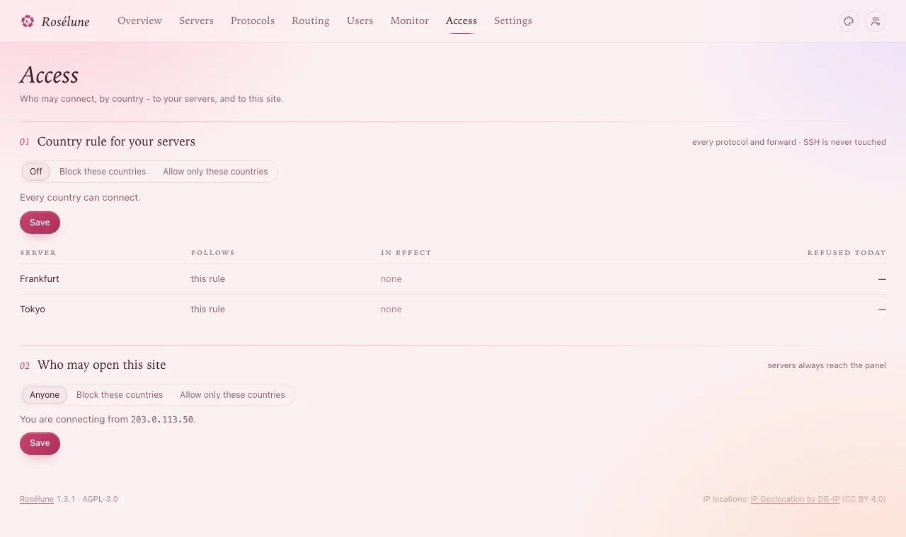

# Country rules

Keep connections from some countries away from your servers - or let in only the countries your
people are in. The rule covers every protocol and port forward; **SSH is never touched**, so you
cannot lock yourself out of a server. Countries come from DB-IP's database, which the panel downloads
by itself.

There are two rules, on the **Access** page:

| Rule | Keeps away from |
|---|---|
| **Country rule for your servers** | Your protocols and forwards. |
| **Who may open this site** | The panel, people's pages, the status page, subscription links - see [Sign-in and the panel's safety](sign-in-security.md#who-may-open-the-site). |

## A rule for all servers

1. **Access** › **Country rule for your servers**.
2. **Block these countries** or **Allow only these countries**.
3. Pick the countries.
4. **Exceptions** (optional): addresses or networks that always get in, one per line - your office,
   say.
5. **Save**. If devices are connected from those countries right now, the panel says how many will
   be cut off; confirm with **Save rule**.

**You should see** *Saved - servers apply it within seconds*, and in the table below each server,
the rule **In effect** and how much it **Refused today**.

> **Good to know:** **Allow only these countries** still lets in private networks and your own
> servers - proxy passes and relays between them keep working.

## A different rule for one server

On the server's page, **Country rule** › **Edit**:

- **Follow the rule for all servers** (the default);
- **No rule on this server** - every country can connect;
- **Its own rule** - **Blocks these countries** or **Allows only these countries**, for this server
  alone.

**Save**. The server applies it within seconds.

## If something goes wrong

| What you see | What to do |
|---|---|
| *The country database is still downloading* | It needs internet access to *download.db-ip.com*; it is ready a few minutes after the panel starts. |
| People in an allowed country are refused | Their provider's addresses are listed in another country (common with mobile and travel networks): add their network under **Exceptions**. |
| A shared server ignores your rule | Its country rule is its owner's (see [Share a server](sharing.md)). |
| Devices that were connected keep working after you saved | Wait a few seconds; open connections from refused countries are cut too. If they stay, the server is offline. |
