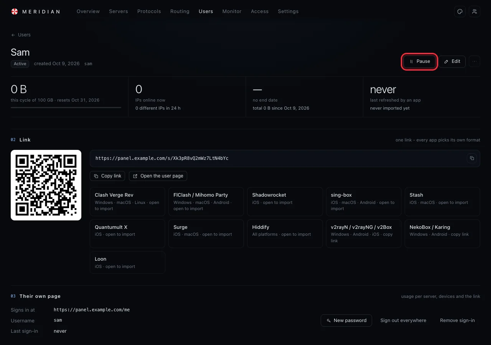
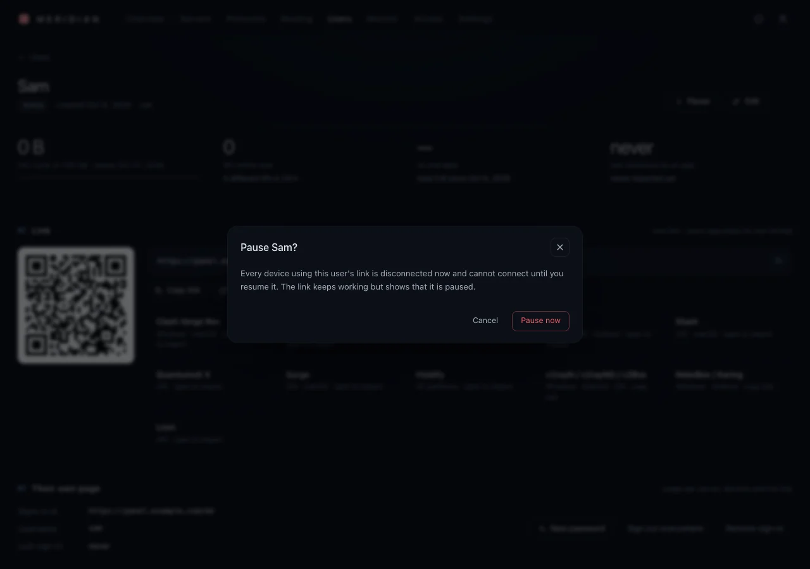
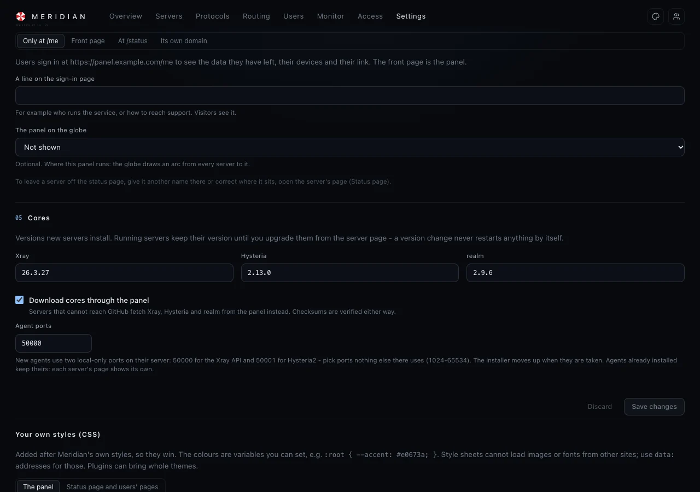

# Everyday tasks

The things you do once the service runs. Each one takes a minute.

## See how everything is doing

**Overview** shows the servers online, the devices connected now, the traffic right now and today,
and a list called **Needs attention** when something does - a user who used up their data, an access
that ended, a server that stopped reporting.

## When someone uses up their data

When a user has used all of their **quota**, the servers stop letting them in at once - by
themselves. The person's page and their link's page tell them why, and when they can connect again.

What they have open at that moment - a download, a call - is your choice, in **Settings › Panel ›
When a user's data runs out**:

| | |
|---|---|
| **Strict: cut at once** (the default) | Everything they have open stops on the spot, on every protocol. |
| **Loose: may finish** | New connections are refused at once; what is open may go on for at most **10 minutes** or **5 GB** more, whichever comes first, then it is cut. You can change both numbers. |

Press **Save** after changing it.

**You should see** a red **Out of data** next to their name in **Users**, and in **Overview › Needs
attention** a line like *Sam used all of their 100 GB - suspended, back on 1 Nov*.

They are back by themselves when their data starts over (on their reset day). Nobody has to click,
and nothing changes in their apps. To let them back in sooner, open the person and press one of:

- **Raise quota** - give them a bigger **Quota per cycle** and press **Save**;
- **Reset usage…** - start their count from zero now.

**You should see** *Out of data* go away, and their devices connect again within seconds.

> **Good to know:** A quota with **Usage resets: Never** does not start over by itself: that person
> stays out until you raise the quota or reset their usage.

## Change someone's speed

1. Open **Users** and click the person, then press **Edit**.
2. Type the new **Speed limit** - for example *200* **Mbps** - or empty it for no limit.
3. Press **Save**.

**You should see** *· 200 Mbps max* under their devices on their page. The servers apply it within
seconds - downloads already running slow down or speed up on the spot, nobody is disconnected.

> **Good to know:** On **Hysteria2** a speed limit needs the person's app to know it: their link
> carries it, and apps take a new link by themselves every few hours. After you **lower** someone's
> limit, their Hysteria2 is turned away until their app has the new link (**Overview** says so); they
> can press *Update* in the app to have it at once. Their other protocols follow the new limit right
> away.

## Other limits and alerts

A user's **end date** and **device limit** never cut anyone off by themselves. When one is reached,
the panel tells you:

- the user is marked in **Users** (for example *Expired*, *Over IP limit*, or *Near quota* when 90%
  of their data is used);
- **Overview › Needs attention** lists it;
- if you set it up, a message arrives on [Telegram](telegram-alerts.md).

You then decide: give more (**Edit**), start a new period, or pause them.

## Pause and resume someone

1. Open **Users** and click the person.
2. Press **Pause**.

   

3. The panel says exactly what will happen. Press **Pause now**.

   

**You should see** *Paused* next to their name, and *Paused just now. Devices cannot connect until
you resume it.* To let them back in, press **Resume** - it works at once, no questions asked.

## Give more data, or more time

Open the person and press **Edit**: change **Quota per cycle**, **Valid until** or **Devices online
at once**, then save. The servers follow within seconds; nobody is disconnected.

To start over on a plan (a new month, say): **⋯ › New period on a plan…**. To set this cycle's
usage back to zero: **⋯ › Reset usage…**.

## Plans: the same limits for many people

**Users › Plans** keeps templates: a quota, how long it lasts, a device limit, a price for your own
records. Pick a plan in the **New user** form, and the person gets all of it at once. Every limit, in
detail: [Limits in detail](limits.md).

## A new password or a new link for someone

| | |
|---|---|
| They forgot their password | Their page in the panel › **New password** (shown once - send it to them). |
| Their link reached someone else | **⋯ › Issue a new link…** - the old one stops working; they add the new one from their page. |
| A device was stolen | **⋯ › Reset credentials…** - the stolen device stops working; the other devices keep the same link and only need to update their profile in the app. |

## The status page

**Settings › Panel › Status page** decides who sees how your servers are doing:

| Where it is | What it means |
|---|---|
| **Only at /me** | Only your users, after signing in to their page (the default). |
| **Front page** | Everyone who opens your panel's address sees the globe and the servers; the panel moves to `/overview`. |
| **At /status** | The same, at `https://panel.example.com/status`. |
| **Its own domain** | On a name of its own, such as `status.example.com`; the panel never opens there. |

> **Good to know:** The status page never shows your users, prices, protocols or keys, and shows IP
> addresses only if you turn that on. Everything it can show: [The status page](status-page.md).
