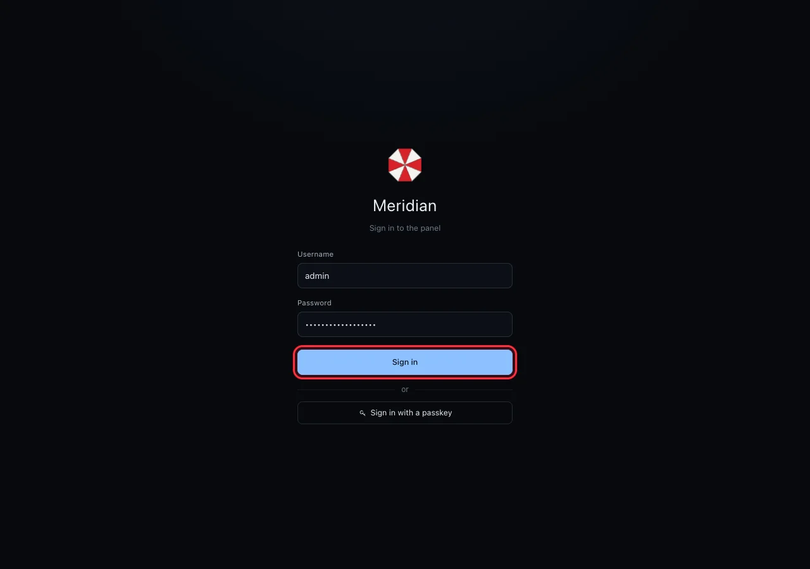
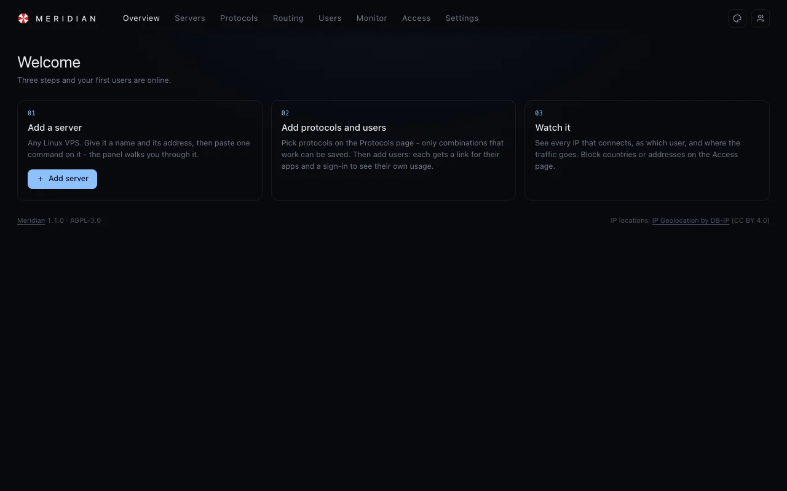
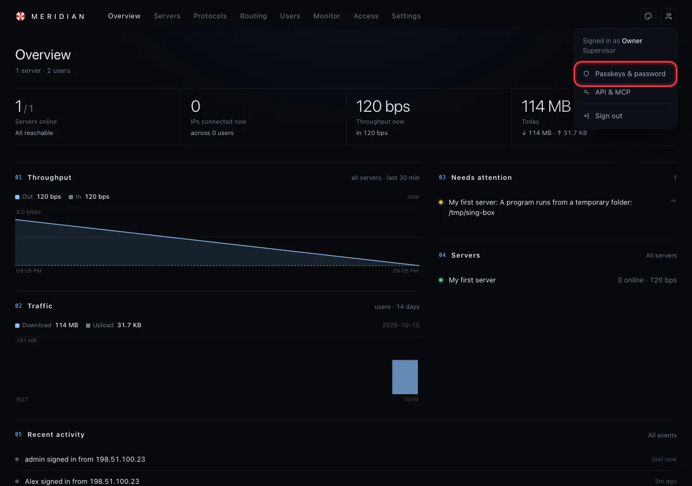
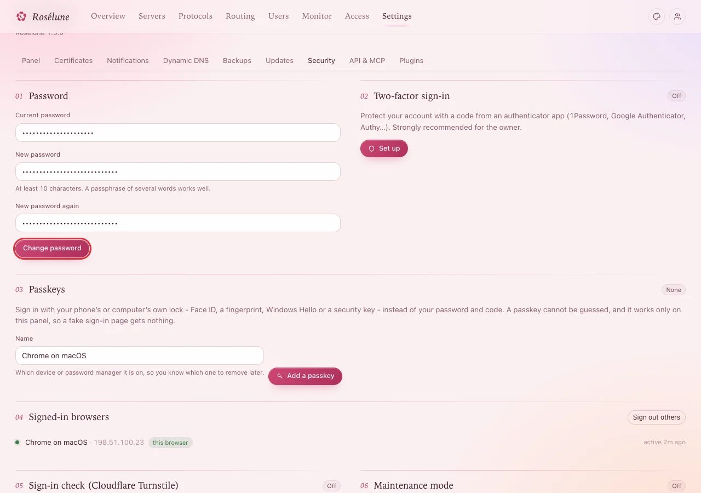
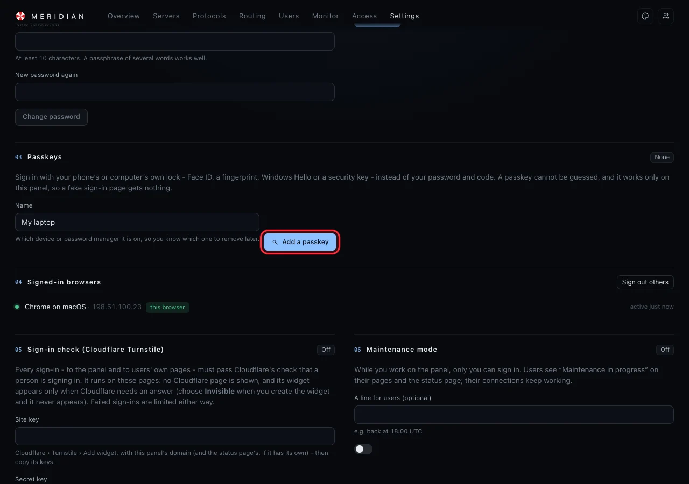
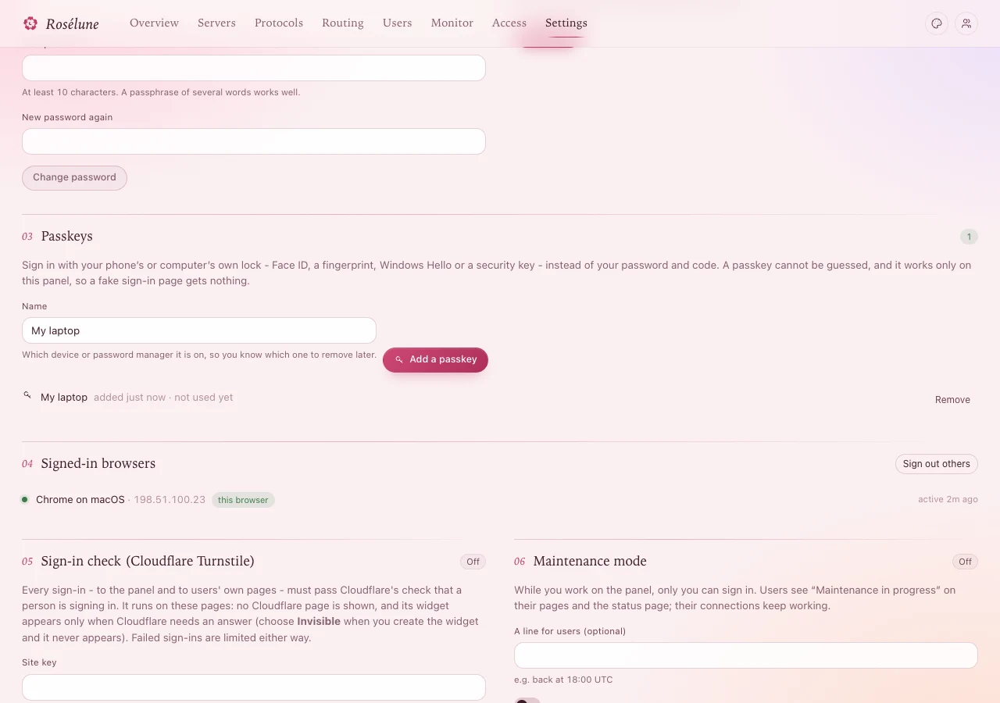
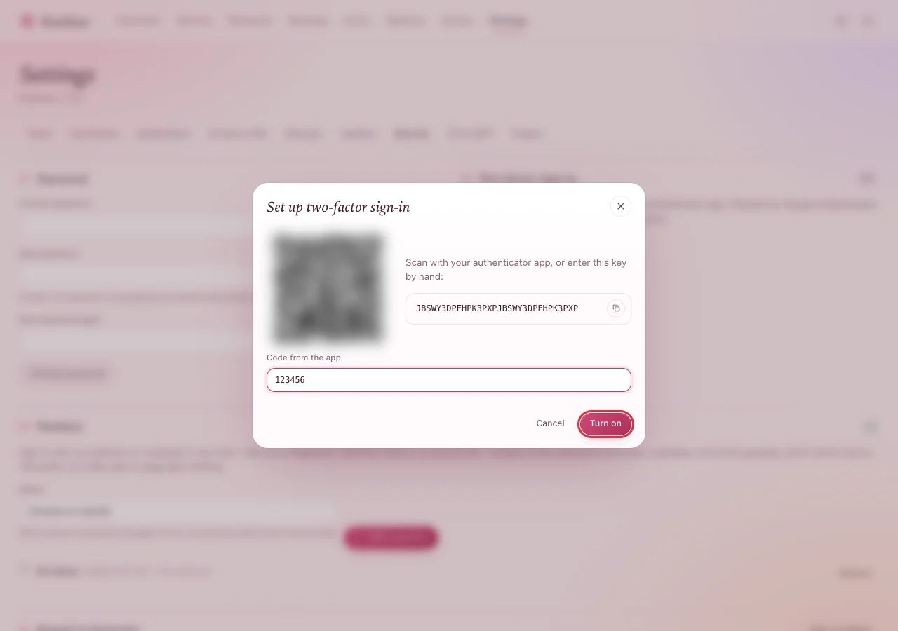

# Sign in the first time

Five minutes. You sign in with the password the installer printed, choose your own password, and
protect the account with a passkey (or a code from an authenticator app). Whoever controls this
account controls every server, so please do not skip step 3.

## 1. Sign in

Open `https://panel.example.com`. Type `admin` as the username and the password from the installer,
then press **Sign in**.

**You should see** the **Welcome** page with three steps. The panel is empty for now.

## 2. Choose your own password

1. Click the **person icon** at the top right, then **Passkeys & password**.

   

2. Under **Password**, type the installer's password in **Current password**, and your new one in
   **New password** and **New password again**. Use at least 10 characters; a few words in a row
   ("granite kettle sunrise orbit") are easy to remember and hard to guess.
3. Press **Change password**.

**You should see** the message *Password changed - other sessions were signed out* at the bottom
of the screen.

## 3. Add a passkey

A passkey lets you sign in with your phone's or computer's own lock - Face ID, a fingerprint,
Windows Hello or a security key - instead of the password. It cannot be guessed, and it only works
on your panel, so a fake sign-in page gets nothing from you.

1. On the same page, under **Passkeys**, give it a name (for example *My laptop*) and press **Add a
   passkey**.
2. Your device asks you to confirm - with your face, a fingerprint, its PIN or by touching the
   security key. Confirm.

   

**You should see** the passkey in the list, with *added just now*.

Next time, press **Sign in with a passkey** on the sign-in page instead of typing the password. On
another device, sign in with your password and add a passkey there too.

> **Tip:** If your passkey is kept by iCloud Keychain, Google Password Manager or a password manager,
> the list marks it *synced*: it works on your other devices as well.

### No passkey? Use a code instead

If your devices cannot make passkeys, turn on **Two-factor sign-in** on the same page:

1. Press **Set up**.
2. Open an authenticator app on your phone (1Password, Google Authenticator, Authy, ...), add an
   account, and scan the square code - or type the key shown next to it.
3. Type the 6-digit code the app shows into **Code from the app** and press **Turn on**.

From now on, signing in with your password also asks for the code from the app.

## 4. A quick look around

The menu at the top has everything:

| | |
|---|---|
| **Overview** | How everything is doing right now: servers online, people connected, traffic. |
| **Servers** | Your servers, their health and their history. |
| **Protocols** | What people's apps connect to on each server. |
| **Routing** | Which sites go out where (optional, for later). |
| **Users** | The people you give access to, their limits and links. |
| **Monitor** | Who connects from where, events, ping times. |
| **Access** | Country rules and blocked addresses (optional). |
| **Settings** | The panel itself: name and logo, notifications, backups, updates, security. |

Next: [Add a server](add-a-server.md).

## If something goes wrong

| What you see | What to do |
|---|---|
| `wrong username or password` | The username is `admin`. Check the password letter by letter (it never has `0`, `O`, `1`, `l` or `I`). |
| `too many failed sign-ins from your address - try again in 15 minutes` | Three wrong passwords in a row. Wait, or reset the password on the server (last row). |
| `too many attempts - wait a few minutes` | Too many tries in a short time. Wait 15 minutes. |
| `Passkeys work only at the panel’s own address (its domain, over HTTPS).` | Open the panel at `https://panel.example.com`, not at its IP address. |
| `No passkey was used - it was cancelled, or it took too long. Try again.` | You (or the device) cancelled the prompt. Press the button again and confirm. |
| `wrong two-factor code - check the time on your phone` | Your phone's clock is off. Set it to automatic time, then use a new code. |
| You lost the phone with the passkey or the authenticator | Sign in with your password (a lost passkey can be removed under **Passkeys**). Lost both the password and the authenticator? On the server: `sudo -u meridian meridian reset-password admin` - it prints a new password and turns two-factor sign-in off. |
