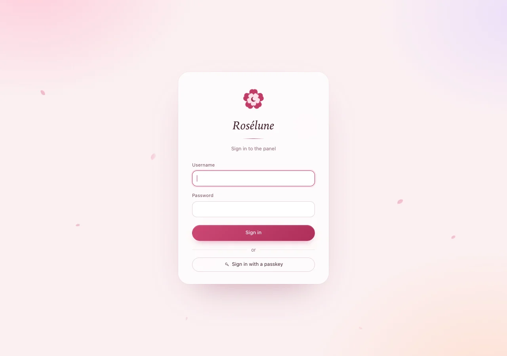

# Install the panel

About five minutes. You paste two commands on your server. The second one asks nothing, installs
everything and prints your first password.

> **Before you start:** all four checks on [Before you begin](before-you-begin.md) are fine, and you
> are logged in to the server as root.

## 1. Download the installer

```bash
curl -fsSLO https://raw.githubusercontent.com/Dokoyamo-Lisa/Meridian/main/skills/meridian-deploy/scripts/install-panel.sh
```

This prints nothing when it works. Check that the file is there:

```bash
ls -l install-panel.sh
```

**You should see** one line that ends in `install-panel.sh`:

```text
-rw-r--r-- 1 root root 2946 Oct 10 01:26 install-panel.sh
```

## 2. Run it

Type your panel's name after `--domain`:

```bash
sudo bash install-panel.sh --domain panel.example.com
```

It finds the newest Rosélune, checks that the download is the real one, installs the panel and its
database (PostgreSQL) and starts it. This takes one or two minutes.

**You should see** this (the version number may be newer):

```text
Downloading Rosélune 1.3.0 for amd64
Checksum OK
Installing Rosélune 1.3.0
Installing PostgreSQL
The panel keeps its data in PostgreSQL (database meridian)
Created symlink /etc/systemd/system/multi-user.target.wants/meridian.service → /etc/systemd/system/meridian.service.
Waiting for the panel to answer

Sign in with:
  username: admin
  password: h7KqM2xPwT9rbCv3nZ
  (this note is deleted after your first sign-in - change the password and turn on two-factor sign-in)

Open https://panel.example.com
Logs: journalctl -u meridian -f
```

> **Warning:** Copy the password now and keep it somewhere safe until you have signed in. It is 18
> letters and digits; it never contains `0`, `O`, `1`, `l` or `I`, so you cannot mix them up.

> **Note:** On Ubuntu, a few lines such as `No services need to be restarted.` appear while
> PostgreSQL is installed. That is normal.

## 3. Open the panel

In your browser, go to `https://panel.example.com`. The first visit can take up to a minute: the
panel fetches its HTTPS certificate right then.

**You should see** the sign-in page:



All good? Go on to [Sign in the first time](first-sign-in.md).

## If something goes wrong

| What you see | What to do |
|---|---|
| `error: run as root: sudo bash install-panel.sh ...` | You are not root. Run `sudo -i`, then the command again. |
| `error: panel.example.com does not resolve yet - create its DNS A record pointing at this server first` | The name has no DNS record yet, or it has a typo. Check step 3 of [Before you begin](before-you-begin.md), wait five minutes, and run the command again. |
| `error: panel.example.com points to 198.51.100.7, but this server's public address is 203.0.113.10 - ...` | The record points somewhere else, or the Cloudflare cloud is orange. Make it point here, with a grey cloud, wait five minutes and run again. |
| `error: port 80 is already in use: users:(("nginx",...)) - stop that program or choose another --listen port` | Another web server runs on this server. See step 4 of [Before you begin](before-you-begin.md). |
| `curl: command not found` | Install it with `apt-get install -y curl`, then start again at step 1. |
| `error: the panel did not start - see: journalctl -u meridian -n 50 --no-pager` | Run that command and read the last lines. If they do not help, [ask for help](troubleshooting.md#ask-for-help) and include them. |
| The browser cannot reach the page | Ports 80 and 443 are closed in your provider's firewall. Open both (TCP) and reload. |
| The browser warns about the certificate | Wait a minute and reload: the certificate arrives with the first visit. If the warning stays, check that ports 80 and 443 are open. |
| You lost the password | On the server, run `sudo -u meridian meridian reset-password admin`. It prints a new one. |

> **Good to know:** Running the installer again is safe. The panel keeps its data, its settings and
> your servers.
