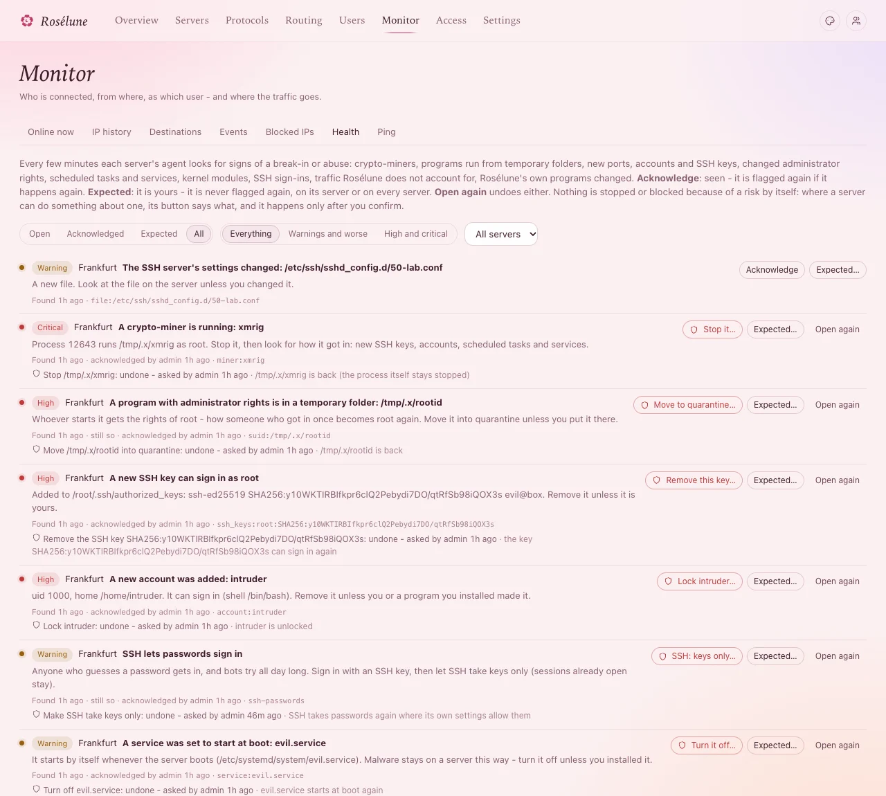
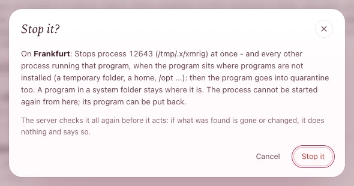

# Keep your servers safe

Every server's agent checks its server every few minutes for signs of a break-in or abuse: a
crypto-miner, a program running from a temporary folder, a new account or SSH key, SSH that takes
passwords, a changed sign-in rule, a scheduled task someone added, and more. It tells you what it
found; **you decide**. Where the server can do something about it, the panel offers a protective
step, which runs only when you click it and confirm.

You need: agent 1.0 or later for the checks, **1.3.1** for protective steps and the newest checks
(**Settings › Updates › Upgrade all agents** - nobody is disconnected).

## 1. See what was found

- **On the server's page**, under the numbers: *Health · nothing needs you · checked 2 min ago* - or
  the open risks. Click it to open the list (it opens by itself when something serious is open).
- **Monitor › Health**: every server's risks, open ones first, with filters for **Status**,
  **Severity** and server.
- **Overview › Needs attention** lists high and critical risks, and the **Health risks**
  notifications send them to you (**Settings › Notifications**).

The first check after an agent starts records what is normal on the server; from then on it reports
what changes.

**You should see** each risk with its severity (**critical**, **high**, **warning**, **info**), what
was found, when, and *still so* while it lasts.

## 2. Decide about each risk

| Button | Means |
|---|---|
| **Acknowledge** | Seen. If it happens again, it is flagged again. |
| **Expected…** | It is yours - a port you opened, your own SSH key, your own service. Never flagged again **On** *this server* **only**, or **On every server** (servers added later too). |
| **Open again** | Undoes either. |

> **Careful:** Only mark expected what you know is yours. A risk may be a real break-in.

## 3. Take a protective step

A risk the server can do something about has a red button:

| Button | Does | Undo |
|---|---|---|
| **Stop it…** | Stops the process (a miner, a program from a temporary folder...). A program outside the system folders goes into quarantine. | The program comes back; the process stays stopped. |
| **Remove this key…** | Takes the SSH key out of its `authorized_keys`. | The key goes back. |
| **Lock** *account*… | Neither a password nor an SSH key gets in any more; what it runs stops. | Unlocked. |
| **Turn it off…** | Stops a service and keeps it from starting at boot. | On again. |
| **Move to quarantine…** | Moves a scheduled task, a sign-in script or a dangerous program file where nothing can use it. | Put back. |
| **SSH: keys only…** | SSH stops taking passwords; only keys sign in. Open sessions stay. | SSH takes passwords again. |
| **Block** *N addresses*… | The addresses guessing SSH passwords can no longer reach SSH on this server. | Unblocked. |

1. Press the button.
2. Read the confirmation: it says exactly what happens, on which server. Press the button there to
   confirm.

   

**You should see** under the risk *Stop /tmp/.x/xmrig: on its way to the server*, then **done** (or
**not done**, with the server's reason), and who asked. The risk is acknowledged; the timeline keeps
the step.

To undo: **Undo** next to it, and confirm.

## What protective steps never do

- **Nothing happens by itself.** Only you, signed in to the panel in a browser, can take a step - never
  an API token, an assistant or the Telegram bot.
- **The server checks again first.** If the process, file, key or account has changed or is gone by
  then, it does nothing and says so.
- **It never locks you out.** **SSH: keys only** is refused unless an account that may sign in has a
  key - make sure one is yours. **Block** never blocks the address you use the panel from, nor one
  that signed in over SSH in the last 90 days.
- **It never touches Rosélune or the system itself**: its own programs and files, root, and the
  system's own services are refused.

## If a server was broken into

The check tells you something is wrong; it cannot know everything an intruder changed. When a risk
looks real - a miner, a key or account you did not add, *ld.so.preload*:

1. Do not mark it expected.
2. **Stop it** for what runs, then remove what brings it back: **Remove this key**, **Lock** the
   accounts, **Turn it off** for services, **Move to quarantine** for scheduled tasks. Change the
   passwords of the accounts that can sign in.
3. **SSH: keys only**, and **Block** the addresses that keep guessing.
4. Not sure you found everything, or the server's own programs were changed? Move people to another
   server (**Edit** › **Access** on their pages), reinstall the server, and add it again.

## If something goes wrong

| What you see | What to do |
|---|---|
| *Health checks need agent 1.0 or later* | **⋯** › **Upgrade agent** on the server. |
| No protective step buttons | The agent is older than 1.3.1 - upgrade it - or nothing can be done about that kind of risk from here. |
| **not done** - *the process is not running any more*, *the file changed since it was found* ... | The server saw something different from what was found, so it did nothing. Look again; a new risk follows if it is still there. |
| **SSH: keys only** is refused | No account that may sign in has an SSH key, or SSH does not read `/etc/ssh/sshd_config.d`. Add your key first. |
| The same harmless thing is flagged on every server | **Expected…** › **On every server**. |
