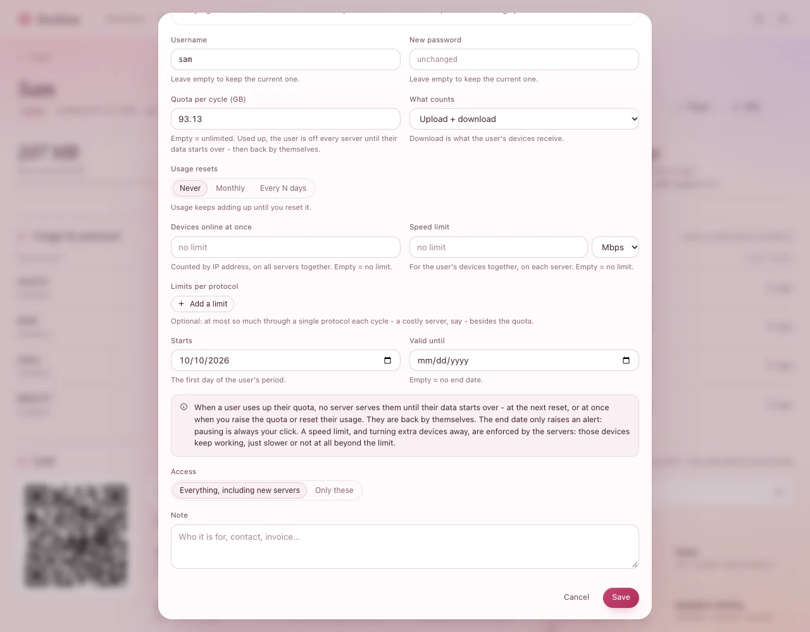

# Limits in detail

What you can limit for each person, what happens when a limit is reached - and what never happens by
itself. You set limits in the person's **Edit** form (or in a plan, below); the servers follow
within seconds and nobody is disconnected by a change.

| Limit | When it is reached |
|---|---|
| **Quota per cycle (GB)** | No server lets them in until their data starts over - then they are back by themselves. |
| **Devices online at once** | An alert - or, if you choose, the extra devices are turned away. |
| **Speed limit** | Their devices are slowed to it. Nothing is cut. |
| **Limits per protocol** | An alert - or, if you choose, that one protocol stops for them. |
| **Valid until** | An alert only. Pausing is always your click. |

## Data

- **Quota per cycle (GB)** - empty is unlimited.
- **What counts**: **Upload + download** (the default), **Download only** (what their devices
  receive), **Upload only**, or **Whichever is larger**.
- **Usage resets**: **Monthly** on a day you choose (the 31st means the last day in shorter months),
  **Every N days** from their **Starts** date, or **Never** - then it adds up until you reset it.

**You should see** on their page *this cycle of 100 GB · resets 1 Nov*, and **Near quota** once they
used 90%.

## When the data runs out

The servers stop letting them in at once, on every protocol, and their link tells them why. What
they have open right then is set in **Settings › Panel** › **When a user's data runs out**:

- **Strict: cut at once** - everything stops on the spot.
- **Loose: may finish** - new connections are refused; what is open may go on for **At most
  (minutes)** or **At most (GB more)**, whichever comes first.

To let them back in sooner: **Raise quota** or **Reset usage…** on their page
([Everyday tasks](everyday.md#when-someone-uses-up-their-data)).

> **Good to know:** Cutting what is open needs agent 1.3 or later. After upgrading agents, press
> **Restart everything on every server…** (same place) once: until a server's proxies restart, a long
> download is counted only when it ends, so strict mode cuts late there.

## Devices online at once

Counted by IP address, on all servers together - a phone and a laptop at home on the same Wi-Fi count
once. Then choose under **More devices than that**:

- **Only an alert** - they are marked **Over IP limit** and you decide.
- **Turn the extra devices away** - a device beyond the limit cannot connect. It gets in once one of
  the others has been offline for two minutes.

**You should see** *IPs online now 3 / 2* in red on their page when they are over, and with turning
away, *1 device over the limit of 2 turned away now* with its address.

## Speed

**Speed limit** in **Mbps** or **Gbps** - for all their devices together, on each server. Running
downloads slow down or speed up on the spot. (On Hysteria2 their app needs the new link first - see
[Everyday tasks](everyday.md#change-someones-speed).)

## Limits per protocol

Besides the quota, at most so much through one protocol each cycle - a costly server, say:

1. In **Edit**, under **Limits per protocol**, press **Add a limit**.
2. Pick the protocol, type the amount and choose **MB**, **GB** or **TB**.
3. **When one is used up**: **Only an alert**, or **Stop that protocol for them** - until their
   cycle starts over; their other protocols keep working.

Their own page shows what is left of each.

## End date

**Valid until** marks them **Expiring** three days before and **Expired** after - with an alert, and a
notification if you turned those on. They keep working until you **Pause** them or give them a new
period: an end date never cuts anyone off by itself.

## Plans: the same limits for many people

**Users › Plans** › **New plan**: a **Name** (*Monthly 100 GB*), how long it **Lasts**, the same
limits as above, the **Access** (which servers), and a **Price (for your records)**. Press **Add
plan**.

- New person: pick the plan under **Plan** in the **New user** form - everything stays editable.
- A new month for someone: their page › **⋯** › **New period on a plan…**, pick the plan
  and the **Starts** date, tick **Start with usage at zero** if their count should start over, and
  press **Start the period**.
- Changing a plan: tick **Change its N users too** to give everyone on it the new limits at once
  (their own dates and usage stay); otherwise only people who get the plan from now on have them.

## If something goes wrong

| What you see | What to do |
|---|---|
| Someone **Out of data** while you expected a reset | **Usage resets** is **Never**, or the reset day has not come. **Reset usage…** lets them in now. |
| A person is cut later than expected in strict mode | Their server's agent is older than 1.3, or its proxies have not restarted since the upgrade: **Restart everything…**. |
| A family is turned away at home | Their devices have different IPs (mobile data): raise **Devices online at once**. |
| Hysteria2 stops for someone after lowering their speed | Their app needs the new link: they press *Update* in the app, or it does so within a few hours. |
