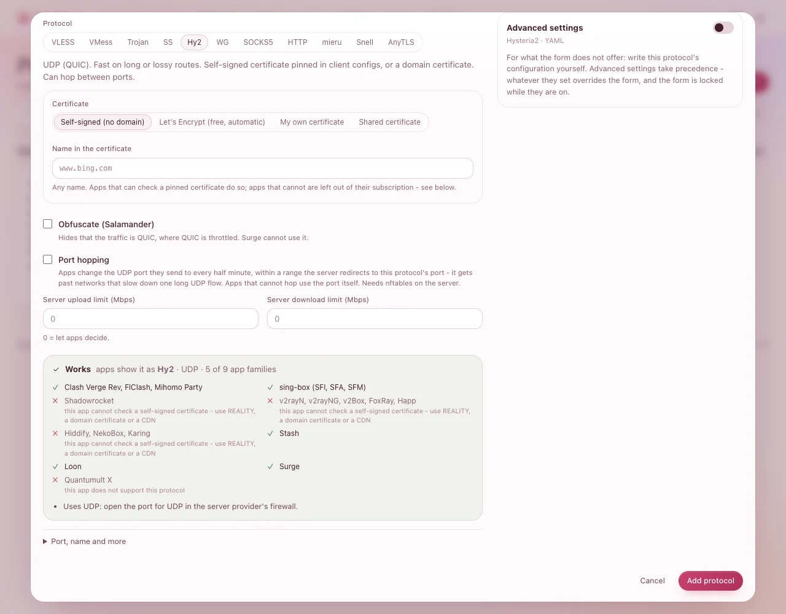

# More protocols

**VLESS · REALITY** suits almost everyone (see [Add a protocol](add-a-protocol.md)). Add another
protocol when some people need something it cannot give them: a faster ride over a long or lossy
route, an app that only speaks something else, a server hidden behind Cloudflare. A server can have
as many protocols as you like; each user gets all of them in their one link.

You need: a server that shows **Online**.

## Which one, for whom

| Protocol | For | Their apps | Open at your provider |
|---|---|---|---|
| **Hysteria2** | People far away from the server, or on unreliable mobile networks: it is faster there | mihomo apps (Clash Verge Rev, FlClash, Mihomo Party), sing-box, Stash, Loon, Surge; with a domain certificate also Shadowrocket, v2rayN and Hiddify | its port, **UDP** |
| **VLESS · WebSocket · CDN** | Hiding the server's address behind Cloudflare (or another CDN) | every app on the list but Surge | the port at your provider, **TCP** |
| **VMess · WebSocket · TLS** | People with Surge or Quantumult X | mihomo apps, sing-box, Stash, Loon, Surge, Quantumult X; with a domain certificate every app | its port, **TCP** |
| **Trojan · TLS** | Looking like an ordinary HTTPS website | as VMess · WebSocket · TLS | its port, **TCP** |
| **Shadowsocks 2022** | Simple, fast, and in every app | every app | its port, **TCP and UDP** |
| **WireGuard** | A full VPN for laptops, phones and offices | the official WireGuard apps, and every other app on the list but Quantumult X | its port, **UDP** |
| **SOCKS5 / HTTP proxy** | A program that only speaks a plain proxy | every app, browsers, scripts | its port, **TCP** |
| **mieru**, **Snell**, **AnyTLS** | Each person on a port of their own | see [A port for each person](per-user-protocols.md) | a range of ports |

Every protocol starts the same way: on the server's page, **Add protocol**, then a choice under
**Start from**. The green **Works** box at the bottom lists the apps that can use it as you set it
up - the panel refuses anything that would not work, and says why.

## Hysteria2

1. **Add protocol** › **Hysteria2** - *Fast on long or lossy routes (UDP)*.
2. Leave **Certificate** on **Self-signed (no domain)**: apps that can check a pinned certificate do
   so. (With a domain, choose **Let's Encrypt** - see [Certificates](certificates.md).)
3. Optional:
   - **Obfuscate (Salamander)** hides that the traffic is QUIC, where networks slow QUIC down. Surge
     cannot use it.
   - **Port hopping**: apps change the UDP port they send to every half minute, within a **Port
     range** such as *20000-30000*. It gets past networks that slow down one long UDP flow. Open the
     whole range for **UDP** at your provider too.
   - **Server upload limit** / **Server download limit** (Mbps): leave *0* to let apps decide.
4. Press **Add protocol**.

**You should see** a card **Hy2** with its port and **udp**. Open that port for **UDP** at your
provider - not TCP.

> **Good to know:** Changing a Hysteria2 protocol (other than port hopping) restarts it once: its
> devices drop and reconnect by themselves. The panel says so before you save.

## Behind Cloudflare: VLESS · WebSocket · CDN

You need a domain whose DNS is at Cloudflare.

1. At Cloudflare: **DNS** › add an **A** record, for example *cdn* → your server's IPv4 address, with
   the cloud **orange** (proxied). In **SSL/TLS**, choose **Flexible**. In **Network**, keep
   **WebSockets** on.
2. In the panel: **Add protocol** › **VLESS · WebSocket · CDN**.
3. **CDN domain**: the name from step 1, for example *cdn.example.com*. **CDN port**: *443*.
4. Open **Port, name and more** and set **Port** to one of the ports Cloudflare passes on over plain
   HTTP: **80, 8080, 8880, 2052, 2082, 2086** or **2095**.
5. Press **Add protocol**.

**You should see** a card with **CDN** and your domain. People's apps connect to Cloudflare, which
passes the traffic on: nobody sees the server's own address.

> **Good to know:** Cloudflare's **SSL/TLS** mode counts for the whole domain. If other websites on
> it need **Full**, leave it there and set **Flexible** for the CDN name alone: **Rules** ›
> **Configuration Rules**, for that hostname, **SSL** › *Flexible*.

## Trojan or VMess with your domain

1. Point a domain (an **A** record, *not* proxied) at the server.
2. **Add protocol** › **Trojan · TLS** (or **VMess · WebSocket · TLS**).
3. **Certificate**: **Let's Encrypt (free, automatic)**, and type the domain under **Domain**. Keep
   TCP port **80** free on the server: the agent gets the certificate there and renews it by itself.
   (Other choices: [Certificates](certificates.md).)
4. Press **Add protocol**.

**You should see** the card; the first time, its certificate arrives within a minute or two.

## Shadowsocks 2022

**Add protocol** › **Shadowsocks 2022**, then **Add protocol**. The **Cipher** list also has
older ciphers for old apps; 2022 ones are faster and safer. Open its port for **TCP and UDP**.

## WireGuard

1. **Add protocol** › **WireGuard**.
2. Choose:
   - **Route all traffic** - on: everything goes through the server; off: only the VPN's own network
     (an office).
   - **Log the names devices look up** - the server's resolver records the sites people visit by
     name.
   - **IPv6 through the tunnel** - only where the server has IPv6.
3. Press **Add protocol**. Open its port for **UDP**.

Each person gets their own configuration (a file and a QR code) on their page, for the official
WireGuard apps. One configuration is one device.

## SOCKS5 or HTTP proxy

**Add protocol** › **SOCKS5 / HTTP proxy**, choose **Protocol** *SOCKS5* or *HTTP*, then **Add
protocol**. Each user signs in to it with their own username and password (on their page).

> **Careful:** SOCKS5 and plain HTTP are not encrypted - use them on networks you trust, or choose
> **HTTP** with **Security** *TLS* for an encrypted HTTPS proxy.

## Change, turn off or remove a protocol

On its card (on the server's page or under **Protocols**):

- **Edit** changes it. If the change alters how apps connect (the transport, the domain, the
  certificate, the port), the panel says that people must update their subscription - apps do it by
  themselves every few hours, or press update in the app.
- The switch turns it **off** and on: off, nobody can connect to it, and it leaves people's links.
- **⋯** (Protocol actions) › **Regenerate keys…** gives it new keys: every device must update its
  subscription.
- **⋯** › **Remove…** deletes it; the confirmation says who is disconnected.

## If something goes wrong

| What you see | What to do |
|---|---|
| The **Works** box is red and says why | Do what it says - it names the setting to change. The panel never saves a combination that would not work. |
| Hysteria2 apps cannot connect | The port is open for TCP instead of **UDP** at your provider, or the network blocks UDP: give those people REALITY too. |
| The CDN protocol does not connect | In Cloudflare: the record must be **proxied** (orange), **SSL/TLS** on **Flexible**, and the port one of 80, 8080, 8880, 2052, 2082, 2086, 2095. |
| *Waiting for the Let's Encrypt certificate* stays | The domain does not point at this server, or TCP port 80 is closed or used by another program. Fix it and wait a minute: the agent tries again by itself. |
| A device stopped working after you edited a protocol | Update the subscription in the app (or wait a few hours: apps do it by themselves). |
