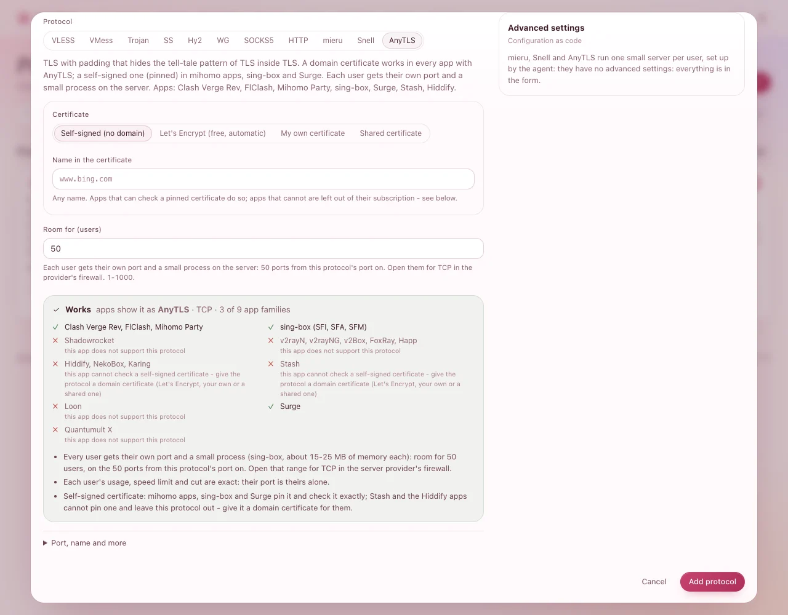

# A port for each person: mieru, Snell and AnyTLS

Three protocols whose servers take one person each: **mieru**, **Snell** and **AnyTLS**. Every user
gets their **own port** and their own small server process, so what each person uses, their speed
limit, their devices and cutting them off are exact - their port is theirs alone.

| | What it is | Their apps |
|---|---|---|
| **mieru** | Traffic that looks like random data, with no pattern to spot | mihomo apps (Clash Verge Rev, FlClash, Mihomo Party), Stash |
| **Snell** | Surge's own protocol, fast and light | Surge, Stash, mihomo apps, sing-box (1.14 and later) |
| **AnyTLS** | TLS whose padding hides the tell-tale pattern of TLS inside TLS | mihomo apps, sing-box, Surge (iOS 5.17, Mac 6.4.3 and later); with a domain certificate also Stash and the Hiddify apps (Hiddify, NekoBox, Karing) |

You need: a server that shows **Online**, with agent **1.3** or later (**1.3.1** for AnyTLS) and
nftables (the install command sets both up on a new server).

## 1. Add the protocol

1. On the server's page, press **Add protocol** and click **mieru**, **Snell** or **AnyTLS**.
2. **Room for (users)**: how many people may use it - *50* by default, up to 1000. Each one gets a
   port, so this is also how many ports it takes: 50 ports from the protocol's port on.
3. For **mieru**, choose **Runs over**: **TCP** works everywhere; **UDP** can be faster on long or
   lossy routes.
4. For **AnyTLS**, choose the **Certificate**: **Self-signed (no domain)** is the quick start; with a
   domain, **Let's Encrypt** lets Stash and the Hiddify apps use it too (see
   [Certificates](certificates.md)).
5. Press **Add protocol**.

**You should see** a card with **Users' ports** - for example *32000 - 32049 · TCP · one each*.

## 2. Open the whole range at your provider

At your provider's firewall, allow the **whole range** shown on the card:

| | Open |
|---|---|
| mieru | the range, **TCP** (or **UDP**, if you chose it) |
| Snell | the range, **TCP and UDP** |
| AnyTLS | the range, **TCP** |

## 3. People use it like any other protocol

Nothing changes for them: their one link now includes it, on their own port (open the person under
**Users** to see it in their list of protocols).

**You should see**, once someone connects, the protocol's card count them under **Online**, and their
usage counted under the protocol on their page.

## What is different about them

- **Memory**: each person's server is a small process - mieru and Snell about 10-15 MB, AnyTLS
  (sing-box) about 15-25 MB. Fifty people on AnyTLS take about 1 GB.
- **Cut means stopped**: a person who runs out of data, is paused or deleted has their own server
  stopped at once; when they are back, it starts again - nobody else is touched.
- **Walled in**: these servers run as an account without any rights, and the server's firewall
  refuses them the server itself and every private network - people reach the internet only.
- **No proxy passes**: they cannot send their traffic out through another server, nor be a proxy
  pass's exit, and they have no configuration as code.
- **mieru over UDP and speed limits**: a person with a speed limit does not get mieru over UDP (it
  stalls under a limit); mieru over TCP, Snell and AnyTLS keep to limits.
- **AnyTLS's certificate**: a renewed certificate is read again by itself - no restart.

## Servers that ran mieru or Snell before 1.3.1

After the agent is upgraded to 1.3.1 (**Settings › Updates**), the server shows **restart needed**:
its mieru and Snell servers still run with full rights. Press **Restart now** on the server's page
when it suits you - each person's server restarts once, under the limited account, and their apps
reconnect by themselves.

## If something goes wrong

| What you see | What to do |
|---|---|
| *AnyTLS needs agent 1.3.1 or later on this server* | Upgrade the server's agent first: **Settings › Updates › Upgrade all agents** (nobody is disconnected). |
| *needs nftables on this server* | Install it on the server (`apt install nftables` on Debian and Ubuntu, `apk add nftables` on Alpine), then try again. |
| *no 50 free ports in a row* | Give the protocol a **Port** under **Port, name and more** where the range is free, or make **Room for (users)** smaller. |
| Some people's apps do not show it | Their app cannot use it: the **Works** box on the protocol lists which can. For AnyTLS with a self-signed certificate, Stash and the Hiddify apps need a domain certificate. |
| A person cannot connect, others can | Their port is outside what you opened at the provider: open the **whole** range. |
| A sing-box app does not show Snell | Snell needs sing-box 1.14 or later in the app: update the app. |
