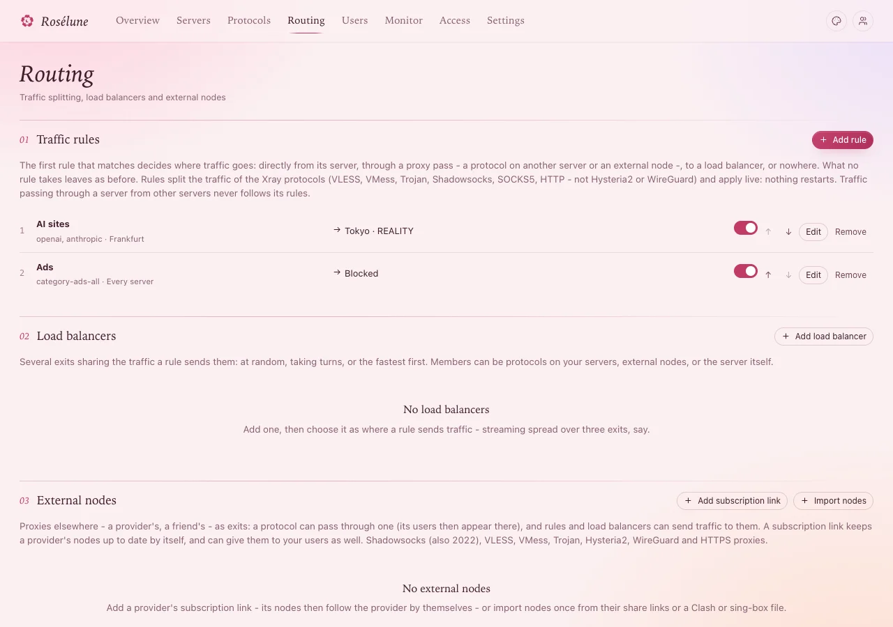

# Send traffic elsewhere

Normally people's traffic leaves the internet from the server they connect to. Four tools change
that:

| Tool | Where | For |
|---|---|---|
| **Proxy pass** | a protocol's form | Everything of one protocol leaves through another server: people connect nearby and appear far away. |
| **Traffic rules** | **Routing** | Some sites go another way - AI sites through Tokyo, ads nowhere. |
| **Load balancers** | **Routing** | Spread traffic over several exits. |
| **External nodes** | **Routing** | A provider's or a friend's proxy as an exit - or for your users too. |

## A proxy pass: connect nearby, leave far away

Say people in Europe should connect to Frankfurt (close and fast) but appear in Tokyo.

1. On Tokyo, have a protocol to pass through - VLESS · REALITY, for example.
2. On Frankfurt, open the protocol people use (**Edit**) › **Port, name and more**. (It must be VLESS,
   VMess, Trojan, Shadowsocks, SOCKS5 or HTTP.)
3. **Proxy pass**: pick *Tokyo · VLESS · REALITY :443*.
4. On Tokyo's protocol, choose whether **Users can also connect to the exit directly** - unticked, it
   serves only the pass and leaves people's links.
5. **Save**.

**You should see**, on a device using Frankfurt, a site such as *db-ip.com* show Tokyo's address and
country. Nobody is disconnected by the change.

> **Good to know:** An exit may pass on once more (a relay) - a chain has two passes at most. A
> protocol ticked **Only for proxy passes** is left out of people's links and serves only passes
> from other servers.

## Traffic rules

1. **Routing** › **Add rule**.
2. **Name** - *AI sites*, say.
3. **Applies to**: **Every server**, **Some servers** or **Some protocols**.
4. What it matches - **Everything**, or any of:
   - **Sites**: ready-made lists by name, such as *openai, netflix*;
   - **Domains** (one per line; *example.com* covers its subdomains), **Addresses**, **Countries**,
     **Ports**, **Network**, **BitTorrent**.
5. **Send it**: **Directly**, **Proxy pass** (choose where under **Through**), **Load balancer**, or
   **Block**.
6. **Add rule**.

**You should see** the rule in the list. It applies at once, without disconnecting anyone. The
**first rule that matches** decides - move rules with the arrows (**Earlier**, **Later**); what no
rule takes leaves as before.

> **Careful:** **Countries** match addresses, but most apps send names: add the country's site list
> too (for example *cn* under **Sites**). A box **What does not work as written** above the list
> says when a rule cannot do what it says, and why.

## Load balancers

1. **Routing** › **Add load balancer**.
2. A **Name**, and how it **Picks**: **At random**, **Taking turns**, or **The fastest**.
3. **Members**: exits on your servers, external nodes, a whole subscription link (all of its nodes,
   as they come and go), or **The server itself (directly)**.
4. **Add**, then make a traffic rule send traffic to it (**Send it** › **Load balancer**).

> **Good to know:** **The fastest** needs one Xray restart on each server that uses it - the server
> shows **restart needed** and waits for your click. Until then it picks at random. Choose what
> happens **When no member answers the latency checks**: **Block** or **Leave directly**.

## External nodes

Proxies that are not yours, as exits.

**A provider's subscription link** (its nodes follow the provider by themselves):

1. **Routing** › **Add subscription link**.
2. A **Name**, the **Subscription address** (HTTPS only) and how often to **Read it again**.
3. Optional: **Only names with** (*HK, JP*), **Leave out names with** (*expire, remaining*), and
   **Put in front of each name**.
4. **Give its nodes to users too**: they then appear in people's links next to your protocols -
   **Every user**, or **Chosen users and plans**. Rosélune cannot count or limit what goes through
   them - the provider does.
5. **Add and read it**.

**Single nodes, once**: **Routing** › **Import nodes** › **Paste links** (*vless://*, *trojan://*,
*hy2://*, a Clash file...) or **Subscription address**, then **Import**.

**You should see** the nodes in the list, each with a switch. **Check** asks one of your servers
whether it can reach a node - nothing is sent through it.

> **Good to know:** Nodes that turn certificate checks off or send traffic unencrypted are left out,
> and so are kinds your servers' Xray cannot connect to - each with the reason. Their passwords and
> keys are never shown again.

## If something goes wrong

| What you see | What to do |
|---|---|
| A rule's target is red: *Its exit cannot be used now: this traffic is blocked* | The exit was turned off or removed: turn it on, or send the rule elsewhere. |
| A site does not take its rule | An earlier rule matched first - move this one **Earlier**. Or the app sends names: use **Domains** or **Sites** rather than **Addresses** or **Countries**. |
| A proxy pass is refused | The exit is on the same server, passes on twice already, or the two servers have no IP version in common (IPv4 only to IPv6 only) - the message says which. |
| **Check** says a node cannot be reached | The node is down, or the server's network blocks it - try **Check** from another server. |
| A subscription link reads no nodes | The provider refused the request: under **Ask as**, pick another app. |
