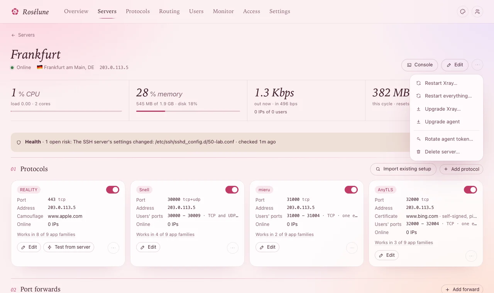

# Your server's page

Click a server under **Servers** to open its page: how it is doing, what it runs, and everything
you can do to it. This page goes through it from top to bottom.

## At the top

- **Online**, **Offline** or **Waiting for agent**, its place and the address people connect to.
- **Console** - a root shell on the server, in the panel (below).
- **Edit** - its name and address, the ports its provider forwards, the IP version, its bandwidth
  plan and price (see [Servers in special places](special-servers.md) for the first ones).
- **⋯** (**More actions**) - restarts and upgrades (below), **Rotate agent token…** and **Delete
  server…**.

Under it, the numbers: CPU, memory, traffic now (and *N IPs of M users*), and this month's traffic
against the plan.

## Restart needed

Rosélune changes what servers run **live**: adding people, protocols, limits - nobody is
disconnected. The few changes that need a restart **wait for you**. The page then shows:

> Waiting for a restart: **...**. Nothing restarts until you say so.

Press **Restart now** when it suits you - the question says who is disconnected (for a few seconds;
apps reconnect by themselves). Only what waits restarts.

## Restart everything

**⋯** › **Restart everything…** restarts, once, everything on the server that carries
traffic: Xray, Hysteria2, each person's own server (mieru, Snell, AnyTLS) and realm forwards - with
whatever waited for a restart - and then the agent.

For all servers at once: **Servers** › **Restart everything** (also in **Settings › Panel**, under
**When a user's data runs out**).

**Use it after upgrading agents** when you use **Strict: cut at once** (see [Limits in
detail](limits.md)): until a server's proxies restart, a long download is counted only when it ends,
so a person whose data runs out is cut late there.

> **Good to know:** Everyone connected is disconnected for a few seconds. Servers with an agent older
> than 1.3.1 are left out (the message says which) - upgrade them first.

## Upgrades

| In the **⋯** menu | What happens |
|---|---|
| **Upgrade agent** | The agent replaces itself with the panel's version. Nobody is disconnected. |
| **Upgrade Xray…** | The server switches to the Xray version set in **Settings › Panel** (**Cores**). Xray restarts once. |
| **Upgrade Hysteria…** | The same for Hysteria2: each Hysteria2 protocol restarts once. |
| **Upgrade realm…** | The same for realm forwards. |

To upgrade every server's agent: **Servers** › **Upgrade all agents** (it appears when some are
older than the panel), or **Settings › Updates**.

## Console

**Console** opens a root shell on the server in a window over the panel - for a quick look or a fix
without SSH. Several servers can be open at once, each in a tab; the **–** button hides the window
while the shells keep running.

- Only you, in your signed-in browser, can open one - never a token, an assistant or a user. The panel
  asks your password again after half an hour.
- Nothing typed or shown is kept. Opening and closing are in the timeline.
- A console with no key pressed for 30 minutes closes.

## Protocols and port forwards

**01 Protocols** lists what the server runs - see [More protocols](more-protocols.md). **Import
existing setup** is here too ([Bring an existing setup](import-existing.md)).

**02 Port forwards** passes a port on this server to another host - to reach a server that is hard
to reach directly, or any TCP or UDP service:

1. **Add forward**.
2. **Listen port** (empty picks a free one), **Target** as *host:port* (for example
   *203.0.113.7:443*), **Network** (**TCP + UDP**, **TCP** or **UDP**).
3. **Engine**: **Kernel (nftables)** - fastest, recommended - or **realm** for a domain as the target,
   or to pass on people's IP addresses (**Send PROXY protocol v2**, only if the target expects it).
4. **Add forward**.

**You should see** the forward in the list, with the bytes it carried. Its switch stops it; the bin
removes it (open connections through it close).

## The rest of the page

- **Network** and **Connected IPs** - the last 30 minutes and the last 24 hours.
- **System** - the machine, the agent's version and every core with its state (a red dot says what
  is wrong).
- **Plan** - its bandwidth plan and what it costs, for your records. The monthly limit only raises
  an alert - nothing is cut off.
- **On the status page** and **Country rule** - see [The status page](status-page.md) and [Country
  rules](country-rules.md).
- **Configuration as code** - your own Xray configuration, merged on top of what the panel makes
  (below).
- **Activity** - everything that happened to it; **All events** opens the full list under
  **Monitor**.
- **Connection to the panel** - how its agent reaches the panel ([A poor route to the
  panel](special-servers.md#a-poor-route-to-the-panel)).

## Configuration as code

For what the forms do not offer, write Xray's configuration yourself:

1. **Configuration as code** › **Write**.
2. JSON (comments allowed). `outbounds` are added (or replace one with the same tag), `inbounds`
   change a protocol by its tag - **Tags** lists them, such as *n12* - or add your own, and other
   sections are merged.
3. **Save**.

**What the server gets** shows the result: the panel's configuration with yours merged in.

> **Careful:** Only the syntax is checked when you save - Xray decides the rest. If it refuses
> something, the page says so and the server keeps its last working configuration. One protocol's
> own settings are in its window instead (**Advanced settings**, on the right).

## Rotate the token, delete the server

- **Rotate agent token…** - use it if the install command leaked. The agent can no longer talk to
  the panel until you run the new install command the page then shows on the server. Traffic keeps
  flowing meanwhile - only management pauses.
- **Delete server…** - type the server's name to confirm. The agent removes everything Rosélune set up
  there (protocols, forwards, firewall rules) and uninstalls itself; everyone using the server is
  disconnected. Its history stays in the panel.

## If something goes wrong

| What you see | What to do |
|---|---|
| **Offline** - *The panel has not heard from this server since ...* | Its protocols keep running if the server is up - only reporting stopped. Check the server is reachable and `meridian-agent` runs (`systemctl status meridian-agent`). |
| *The server could not apply the latest configuration* | It keeps running the last working one. The box shows Xray's own words: undo what you changed last (often **Configuration as code**). |
| **Restart everything…** is greyed out | The agent is older than 1.3.1: **Upgrade agent** first (nobody is disconnected). |
| **Console** is missing | The server is offline, or the console is turned off on it (`/etc/meridian-agent/no-console`). |
| A core has a red dot under **System** | The error is next to it. If a restart is waiting, **Restart now**. Otherwise open the **Console** and read the core's log - for Xray: `journalctl -u meridian-xray -n 50`. |
