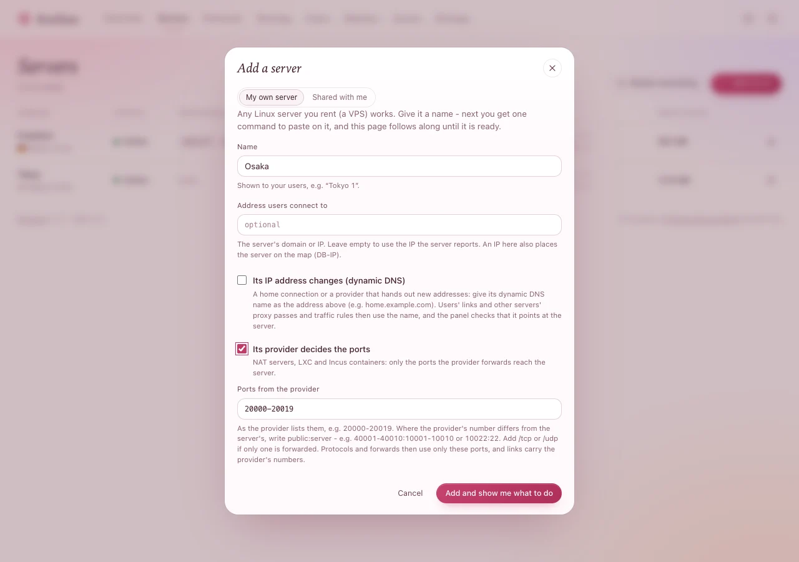

# Servers in special places

Most servers you rent need nothing special. These do: a server whose **provider decides the
ports**, one whose **IP address changes**, one with **IPv6 only**, one with **several IP addresses**,
and one whose **route to the panel is poor**.

You need: the server added to the panel (see [Add a server](add-a-server.md)), or about to be.

## The provider decides the ports (NAT servers, LXC, Incus)

A cheap NAT server or a container shares its provider's IP address: only the ports the provider
forwards reach it - its page there says something like *ports 20000-20019*.

1. When you add the server, tick **Its provider decides the ports**. (Already added: **Edit** on its
   page.)
2. Under **Ports from the provider**, write them as the provider lists them:

   | The provider's page says | Write |
   |---|---|
   | Ports 20000-20019 | `20000-20019` |
   | Public 40001-40010 go to 10001-10010 on the server | `40001-40010:10001-10010` |
   | Public 10443 goes to 443, SSH on 10022 to 22 | `10443:443, 10022:22` |
   | TCP only on 20000-20009, UDP only on 20010-20019 | `20000-20009/tcp, 20010-20019/udp` |

3. Press **Add and show me what to do** (or **Save**).

**You should see** new protocols and port forwards take one of those ports by themselves; a port
outside them is refused, with the list. People's links carry the number their devices connect to -
the provider's.

> **Good to know:** Hysteria2 and WireGuard need a port the provider forwards for **UDP**. For a
> Let's Encrypt certificate, the provider must forward public port **80** (to any port on the
> server); without it, use a self-signed certificate. Changing the list restarts nothing; protocols
> left outside it are listed on the server's page.

## The IP address changes (dynamic DNS)

A server on a home connection, or with a provider that hands out new addresses, is reached by a
**name** that follows it, such as *home.example.com*.

1. In the server's dialog (when adding it, or **Edit**), write the name under **Address users
   connect to** (**Address clients connect to** in **Edit**).
2. Tick **Its IP address changes (dynamic DNS)**.
3. If your router or an updater program keeps the name up to date, you are done. If not, and the
   name's domain is at Cloudflare, let the panel do it:
   1. At Cloudflare: **My Profile › API Tokens › Create Token**, the template **Edit zone DNS**, for
      the name's zone.
   2. In the panel: **Settings › Dynamic DNS**, paste it under **Cloudflare API token**, press **Test**
      (it changes nothing - it says which zone the name is in), then **Save token**.
   3. In the server's dialog, tick **Keep the name pointing at this server with Cloudflare**, save, and
      confirm with **Keep it up to date**.

**You should see**, on the server's page, a line **Dynamic DNS · home.example.com** → its addresses,
*checked 2 min ago* - and with Cloudflare, *kept up to date*.

Every link to the server now uses the name, so people's apps follow it to the new address. The panel
only ever touches that name's A and AAAA records - DNS only, never proxied (the proxy would break the
protocols) - and nothing else in the zone.

## IPv6 only

1. On the server's page, **Edit** › **IP version** › **IPv6 only**, then **Save**.
2. The panel needs an IPv6 address too, or the server cannot reach it: give the panel's domain an
   **AAAA** record (at your DNS provider) pointing at the panel's IPv6 address. The **Add a server**
   dialog warns *For servers with IPv6 only* when it has none.

People whose network has no IPv6 cannot reach such a server - give them another server too. The panel
refuses a proxy pass or traffic rule between an IPv6-only server and one without IPv6, and says why.

> **Tip:** **IP version** also has **IPv4 only**, for a server whose IPv6 is unreliable. Xray takes
> the change at once; Hysteria2 protocols restart once.

## Several IP addresses

A server with more than one public address can give each protocol its own:

1. In the protocol's form, open **Port, name and more**.
2. **Server address for this protocol**: pick one of the addresses (the agent lists them once it is
   connected).
3. Save.

The protocol listens there, its traffic leaves from there, and links use it - so two protocols on
different addresses can even share a port. (**Address override**, in the same place, changes only
the address in links - for example a domain name.)

## A poor route to the panel

If a server keeps losing the panel - its page warns *Keeps losing the panel* - let it reach the panel
through another of your servers with a good route to both:

1. On the server's page, find **Connection to the panel**.
2. **Reach the panel through**: pick the other server, press **Save**, then **Go through** *that
   server*.

**You should see**, within a minute, *Reaches the panel through* that server. Nothing changes for the
people using it: only the agent's reports take the detour, still encrypted end to end. If that
server's provider filters what comes in, open the TCP port shown on its page (**Relays** ... *on TCP
port*).

To have this done by itself when a server keeps losing the panel: **Settings › Panel** › **When a
server keeps losing the panel, relay it through** - a server. It switches such a server once, and
tells you.

## If something goes wrong

| What you see | What to do |
|---|---|
| *port ... is not one of the ports this server's provider forwards* | Choose a port from the list, or correct **Ports from the provider** in **Edit**. |
| Hysteria2 or WireGuard does not connect on a NAT server | Its port must be forwarded for **UDP** by the provider. Write `/udp` ports in the list if the provider forwards them separately. |
| *home.example.com points at ... but the server's address is now ...* | Your dynamic DNS has not updated the name yet. With Cloudflare: **Settings › Dynamic DNS** › **Test** says why. |
| *Cloudflare refused the token* | Make the token again with the template **Edit zone DNS**, for the zone of the name. |
| An IPv6-only server stays **Waiting for agent** | The panel's domain has no AAAA record: add one, then run the install command again. (A server whose provider carries IPv6 to IPv4 for it - NAT64 - gets through without.) |
| *The relay through ... failed* | The port on the relaying server is filtered by its provider, or that server is offline: open the port, or pick another server. |
