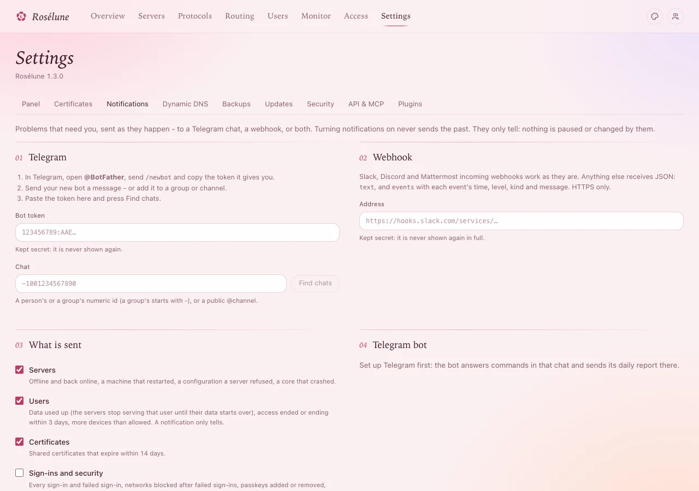

# Alerts on Telegram

Ten minutes, once. A Telegram bot of your own tells you when something needs you: a server stopped
reporting, someone used up their data, someone signed in. It only tells - nothing is paused or
changed by a message.

You need: Telegram on your phone or computer.

## 1. Make a bot

1. In Telegram, open **@BotFather** (the official one, with the blue tick) and send `/newbot`.
2. It asks for a **name** (anything, for example *My Rosélune*) and a **username** that ends in
   `bot` (for example *mymeridian_alerts_bot*).
3. It answers with a **token**, a long line like `123456789:AAH...`. Copy it.

> **Warning:** The token is the key to your bot. Do not share it; paste it only into the panel.

## 2. Say hello to your bot

Open your new bot (BotFather's answer has a link to it) and send it any message, for example *hi*.
The panel can only find chats that wrote to the bot. To get alerts in a group instead, add the bot
to the group and write something there.

## 3. Connect it to the panel

1. In the panel, open **Settings › Notifications**.
2. Paste the token into **Bot token**.
3. Press **Find chats**, and pick your chat (or the group) in **Chat**.
4. Press **Save**, then **Send a test message**.

**You should see** the test message arrive in Telegram within a few seconds.

## 4. Choose what is sent

Under **What is sent**, tick what you want to hear about:

| | |
|---|---|
| **Servers** | Offline and back online, a machine that restarted, a configuration a server refused, a core that crashed. |
| **Users** | Data used up (the servers stop serving that person until their data starts over), access ended or ending within 3 days, more devices than allowed. |
| **Certificates** | Shared certificates that expire within 14 days. |
| **Sign-ins and security** | Every sign-in and failed sign-in, passkeys added or removed, blocked networks, password and two-factor changes, new API tokens. |
| **Health risks** | Signs of a break-in on a server: a crypto-miner, a new account or SSH key, a program run from a temporary folder. |

Save again.

> **Tip:** The bot also answers commands in that chat - `/status` for a summary, among others - and
> can send a daily report. [Telegram in detail](../../docs/telegram.md) lists everything, including
> how your users can link their own Telegram to see their data.

## If something goes wrong

| What you see | What to do |
|---|---|
| **Find chats** finds nothing | Send your bot a message first (step 2), then press **Find chats** again. |
| The token is refused | Copy it again from BotFather - the whole line, without spaces. If you made a new token there, the old one stopped working. |
| The test message does not arrive | Check that the right chat is picked. In a group, the bot must still be a member. |
| You get too many messages | Untick groups under **What is sent** - **Sign-ins and security** is the busiest. |
