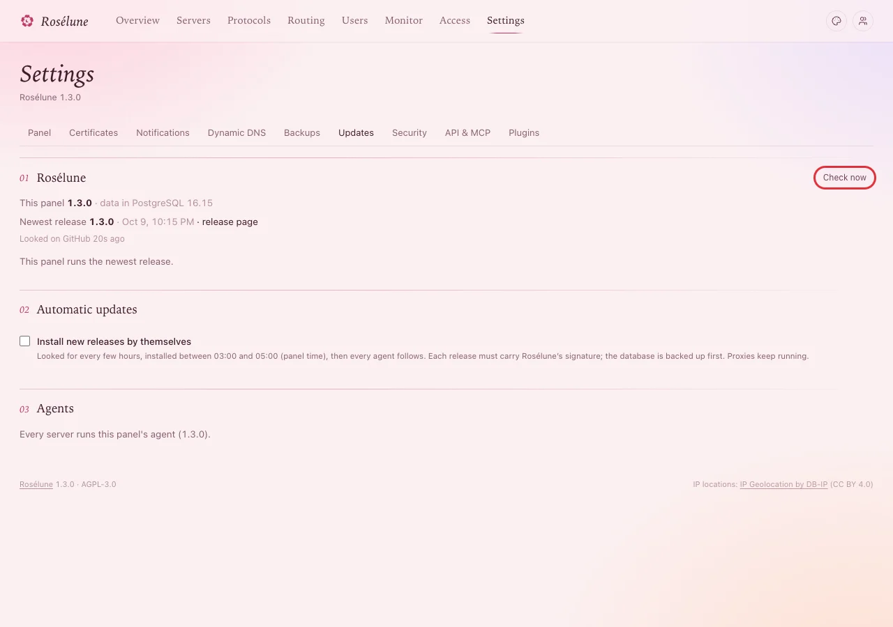
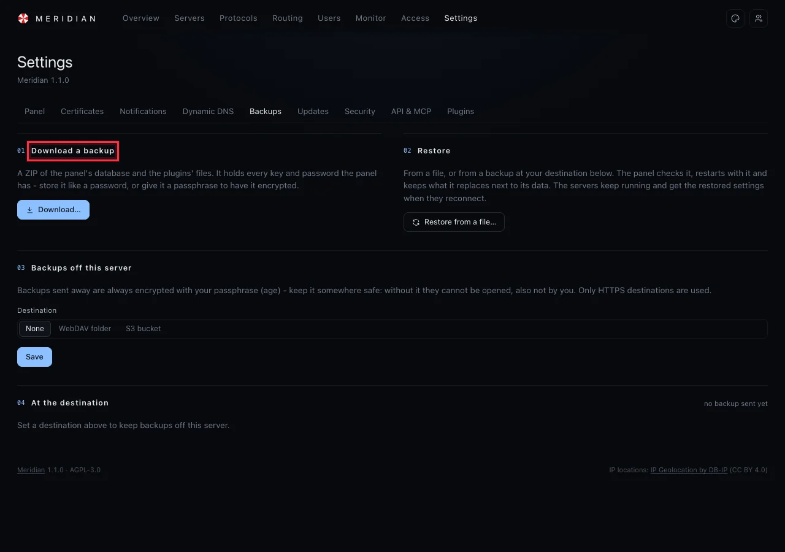

# Updates and backups

Keep the panel current and your data safe. Updating takes one click; a backup takes one more.

## Update the panel

Open **Settings › Updates**. It says which version runs, which is the newest, and when the panel last
looked.



When there is a newer one, it says *Meridian 1.2.0 is available* (with **What is new**):

1. Leave **Then upgrade every server's agent** ticked.
2. Press **Update now**.

**You should see** *Downloading and checking Meridian 1.2.0…*, then *Installing Meridian 1.2.0 - the
panel restarts in a moment; this page reconnects by itself.* After about a minute the page shows the
new version. The panel saved a copy of its data first.

> **Good to know:** Nobody is disconnected by an update. The servers keep serving while the panel
> restarts, and their agents are upgraded one by one without touching your users' connections. The
> panel only installs releases that carry Meridian's signature.

### Or let it update itself

Turn on **Automatic updates › Install new releases by themselves**. The panel then looks for new
releases every few hours and installs them between 03:00 and 05:00 (panel time), and the agents
follow.

### Agents that are older than the panel

If **Agents** says *1 server runs an older agent* (or more), press **Upgrade all agents**. The panel
asks *Upgrade the agent on 1 server?* and says what happens: each agent fetches the new agent from
the panel and restarts itself, while the proxies keep running. Press **Upgrade agents**.

**You should see**, within a minute, *Every server runs this panel's agent (1.2.0).* It is safe at any
time: nobody is disconnected.

## Back up

### Download a backup

**Settings › Backups › Download…** saves a ZIP with everything the panel knows: servers, users,
settings and keys.



> **Warning:** A backup holds every key and password of the panel. Store it like a password - or give
> it a **passphrase** when you download it, so it is encrypted.

### Backups that go somewhere else by themselves

Under **Backups off this server**, choose a **WebDAV folder** or an **S3 bucket**, give a passphrase
and save. Backups then leave the server regularly, always encrypted with your passphrase.

> **Stop:** Keep the passphrase somewhere safe, away from the server. Without it, nobody can open
> those backups - you neither.

### From the command line

On the panel's server:

```bash
sudo -u meridian meridian backup --data /var/lib/meridian /var/lib/meridian/my-backup.db
```

**You should see:**

```text
Backup written to /var/lib/meridian/my-backup.db
It contains every key and credential - store it like a password.
Restore: stop the panel, then: meridian restore --data /var/lib/meridian /var/lib/meridian/my-backup.db
```

## Restore

**Settings › Backups › Restore from a file…**, then choose the backup (and type its passphrase if it
has one). The panel checks it, restarts with it and keeps the data it replaces next to it. The
servers keep running and pick up the restored settings when they reconnect.

## Update by hand (if the panel cannot update itself)

On the panel's server, run the installer again with `--upgrade`:

```bash
curl -fsSLO https://raw.githubusercontent.com/Dokoyamo-Lisa/Meridian/main/skills/meridian-deploy/scripts/install-panel.sh
sudo bash install-panel.sh --upgrade
```

**You should see**, ending with:

```text
Installing Meridian 1.2.0
Meridian upgraded. Servers keep running; upgrade their agents in Settings > Updates (Upgrade all agents) when convenient.
```

## If something goes wrong

| What you see | What to do |
|---|---|
| *The last update did not go through:* and a reason | Read the reason; most often the server could not reach GitHub. Press **Check now** and try again later. Nothing changed: the old version keeps running. |
| The page does not come back after an update | Wait two minutes and reload. Then on the server: `systemctl status meridian --no-pager` and `journalctl -u meridian -n 50 --no-pager`. |
| **Update now** is missing and a sentence says why | The panel cannot install updates itself on this host (for example, it was not installed with the installer). Use **Update by hand**. |
| A restore is refused | The file is not a Meridian backup, or the passphrase is wrong. |
