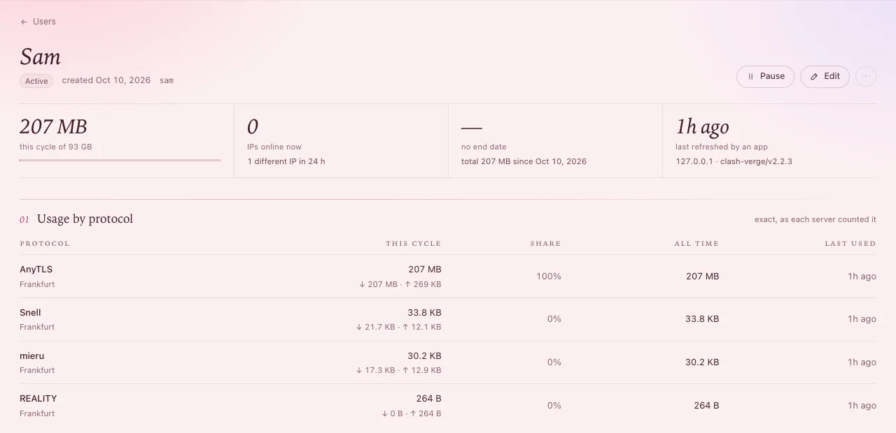

# A person's page

Click someone under **Users** to open their page: what they use, their link, their sign-in, and
everything you can do for them.

## At the top

Next to their name: **Active**, **Online**, **Paused** or **Out of data**, and marks such as **Near
quota**, **Expiring**, **Expired** or **Over IP limit**.

The **⋯** button (More actions) holds the rest.

| Button | What it does |
|---|---|
| **Pause** / **Resume** | Pause disconnects every device using their link until you resume - the panel asks first. Resume works at once. |
| **Edit** | Their limits, dates, which servers and protocols they get, their note (see [Limits in detail](limits.md)). |
| **⋯** › **Issue a new link…** | Their link stops working - for a link that reached someone else. Devices that imported it stay connected but cannot refresh until they import the new one. |
| **⋯** › **Reset credentials…** | Every device using their link is disconnected and must refresh the subscription; the link stays the same. For devices that copied the configuration. |
| **⋯** › **Reset usage…** | This cycle's usage back to zero (the total stays). Someone out of data can connect again at once. |
| **⋯** › **New period on a plan…** | Starts a new period with a plan's limits - a new month, say. |
| **⋯** › **Delete…** | Type their name to confirm. Their link stops working for good and they can no longer sign in. |

Under it, four numbers: what they used **this cycle** (of their quota, and when it resets), **IPs
online now** (of their device limit, and their speed limit), **valid until**, and when an app last
refreshed their link.

## Their link

**02 Link** holds the one link that works in every app: the QR code, **Copy link**, and **Open the
user page** - what they see when they open the link in a browser. Below it, a button per app: some
open the app to import, the others copy the link in the app's own format.

Send them the link (or let them sign in and take it from their page - below). How they set up their
apps: [Connect a phone or computer](connect-devices.md).

## Their own page

**03 Their own page** - a person with a sign-in sees, on your site, their link, their devices and
what they used on each server:

- No sign-in yet: **Give** *Sam* **a sign-in** - a password is made and shown **once**. Copy it.
- **New password** - a new one, shown once; the old one stops working and they are signed out
  everywhere.
- **Sign out everywhere** - every browser where they are signed in.
- **Remove sign-in** - they can no longer sign in; their link keeps working.

People can also link their Telegram account and ask your bot for what they have left: turn on **Users
can link their Telegram accounts** under **Settings › Notifications** (see [Alerts on
Telegram](telegram-alerts.md) for the bot).

## The tabs

| Tab | What it shows |
|---|---|
| **Online now** | Each device connected now: its IP, where from, the server and protocol. **Block** shuts an address out. |
| **IP history** | Every address they used, with country and network - to spot a shared link. |
| **Destinations** | The sites they reached (only if **Record destinations** is on in **Settings › Panel**). |
| **Traffic** | Their usage over time, split by server or protocol. |
| **Endpoints** | Each protocol on its own: a share link, a QR code, and for WireGuard the configuration file. |
| **Activity** | Everything that happened to them. |
| **Config preview** | Exactly what a given app gets from their link - pick the app. |

## Which servers they get

In **Edit**, under **Access**:

- **Everything, including new servers** - every server and protocol, now and later (the default).
- **Only these** - tick whole servers (protocols added to them later come along) or single
  protocols.

**You should see** their link change within seconds; apps pick it up the next time they refresh it.

## If something goes wrong

| What you see | What to do |
|---|---|
| *This user's link covers no server with a protocol yet* (Endpoints) | Add a protocol to a server, or give them more servers under **Access** in **Edit**. |
| A protocol is missing from their app | Their app cannot use it: **Config preview** for that app lists what was left out and why. |
| They lost their password | **New password**, and send it to them. |
| Someone else uses their link | **Issue a new link…**, then send them the new one. Check **IP history** for where it was used. |
| Their device is **Over IP limit** | More devices than their limit are online at once - see [Limits in detail](limits.md). |
